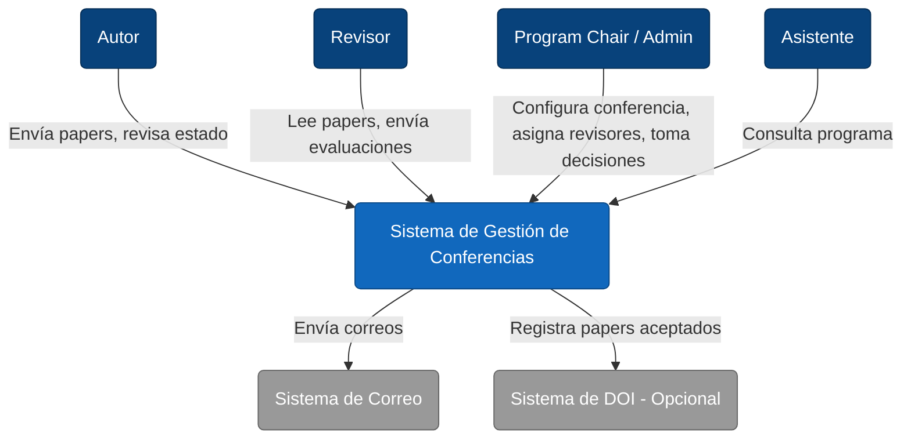
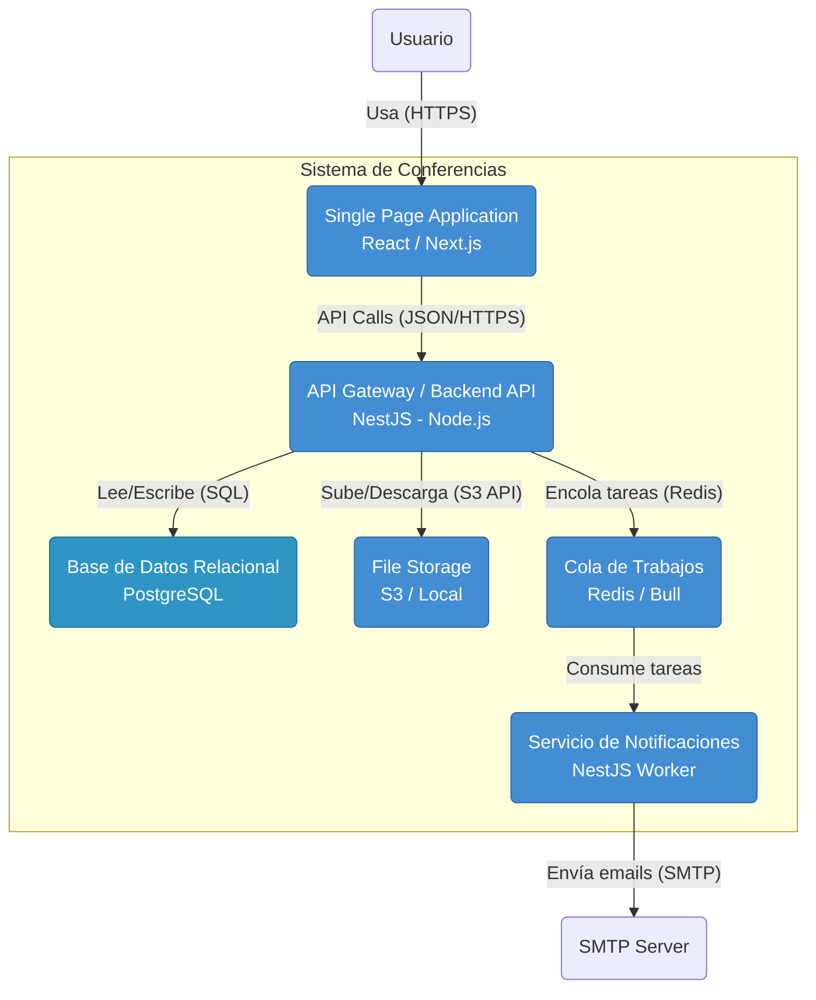

# Arquitectura del Sistema de Gestión de Conferencias

## 1. Stack Tecnológico Recomendado

Para un sistema de gestión de conferencias que requiere flujos de trabajo complejos, roles bien definidos y consistencia en los datos, se recomienda el siguiente stack tecnológico:

### Backend: **Node.js con NestJS (TypeScript)**
- **Por qué**: NestJS proporciona una estructura robusta y escalable, ideal para modelar dominios complejos. Su soporte nativo para TypeScript asegura tipado fuerte, reduciendo errores en tiempo de ejecución.
- **Arquitectura Modular**: Facilita la implementación de un "Monolito Modular", donde cada módulo (Papers, Reviews, Users) encapsula su lógica, facilitando una futura migración a microservicios si el sistema escala.

### Base de Datos: **PostgreSQL**
- **Por qué**: La naturaleza relacional de los datos (Papers, Autores, Revisiones, Calificaciones) se adapta perfectamente a SQL. PostgreSQL ofrece robustez, soporte JSONB para metadatos flexibles y transacciones ACID.

### Frontend: **React o Next.js**
- **Por qué**: Permite construir interfaces de usuario interactivas y reactivas, cruciales para los formularios de envío de papers y las interfaces de evaluación de revisores.

### Infraestructura Adicional
- **Colas de Mensajes (Redis/Bull o RabbitMQ)**: Para manejar tareas asíncronas como el envío de correos masivos (notificaciones a autores y revisores).
- **Almacenamiento de Archivos (S3 / MinIO)**: Para almacenar los PDFs de los papers de manera segura y escalable.

---

## 2. Patrones Arquitectónicos

### Monolito Modular
En lugar de microservicios distribuidos desde el inicio (que añaden complejidad operativa), se sugiere un monolito bien estructurado en módulos independientes.

**Módulos Principales:**
1.  **Identity & Access (IAM)**: Gestión de usuarios (Autores, Revisores, Chairs), autenticación y autorización.
2.  **Conference Core**: Gestión de la conferencia, fechas, fases (Call for Papers, Review, Decision).
3.  **Submission Context**: Gestión del ciclo de vida de los papers (Borrador -> Enviado -> En Revisión -> Aceptado/Rechazado).
4.  **Review Context**: Asignación de revisores, formularios de evaluación, puntuaciones.
5.  **Program Planning**: Organización de papers aceptados en sesiones y horarios.

### Domain-Driven Design (DDD)
Aplicar tácticas de DDD para modelar la complejidad del negocio:
- **Entidades Ricas**: `Paper`, `Review`, `Conference`.
- **Value Objects**: `Score`, `Decision`, `PaperStatus`.
- **Agregados**: `SubmissionAggregate` (que asegura la consistencia entre un paper y sus autores).

### Event-Driven Architecture (Interna)
Uso de eventos de dominio para desacoplar módulos. Por ejemplo:
- Cuando un `Paper` es enviado -> Evento `PaperSubmitted`.
- El módulo de `Notificaciones` escucha este evento y envía el correo de confirmación.
- El módulo de `Review` puede preparar las estructuras para futuras asignaciones.

---

## 3. Diagramas de Arquitectura

### Nivel 1: Diagrama de Contexto del Sistema (Context Map)

Muestra el sistema en el centro y sus interacciones con los usuarios y sistemas externos.

### Nivel 2: Diagrama de Contenedores

Muestra la arquitectura interna de alto nivel y las tecnologías.

