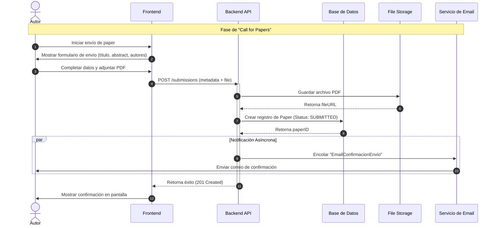
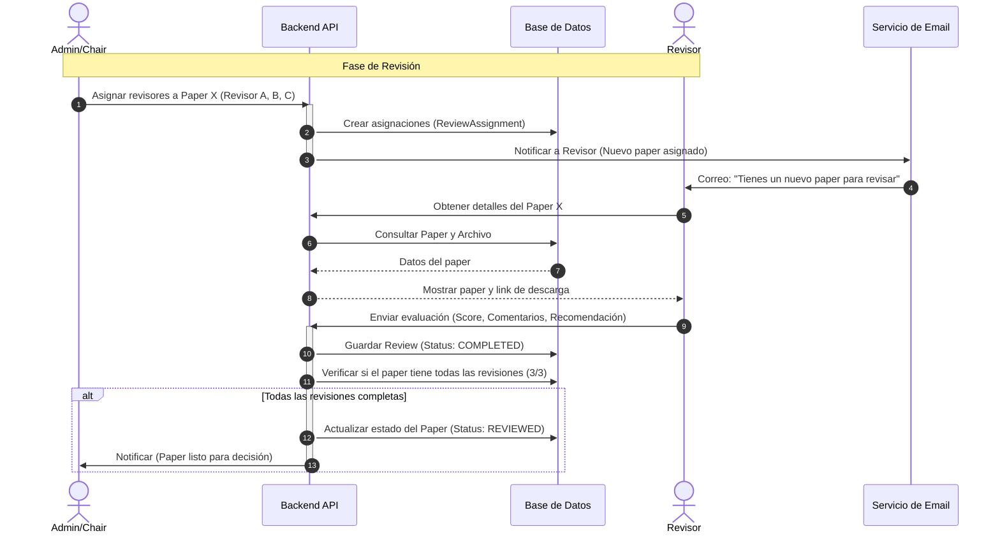
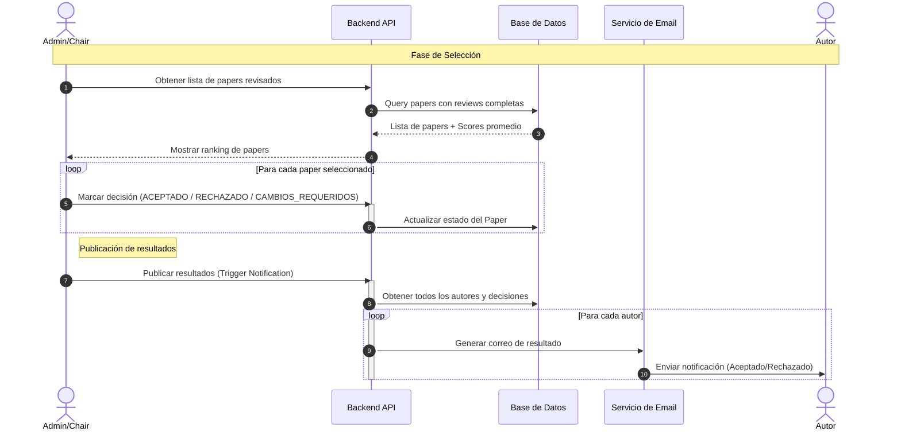
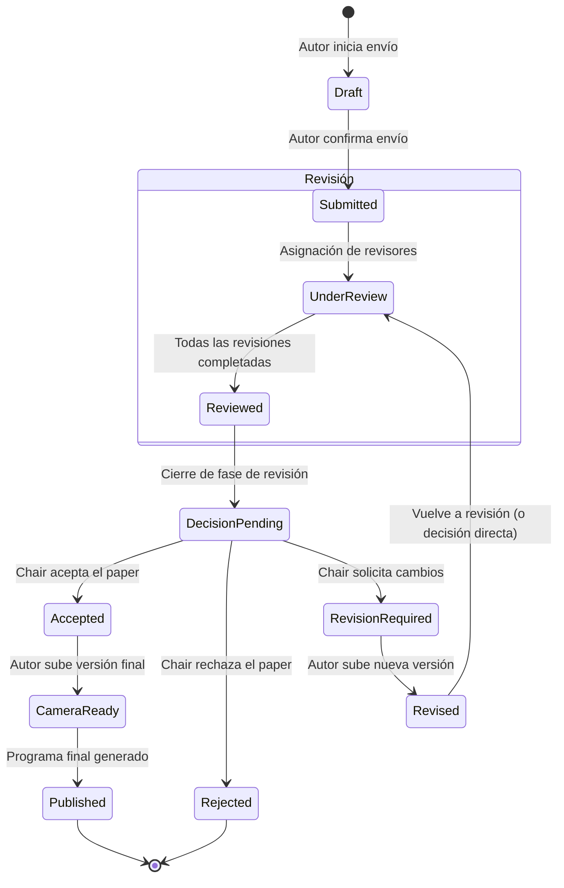

# Diagramas de Flujo y Procesos

Estos diagramas detallan los flujos de trabajo principales del sistema de conferencias, utilizando diagramas de secuencia y de estado UML.

## 1. Diagrama de Secuencia: Envío de Papers (Submission Phase)

Este flujo describe cómo un autor envía su trabajo inicial al sistema.

## 2. Diagrama de Secuencia: Asignación y Revisión (Review Phase)

El administrador (Chair) asigna revisores y estos evalúan los papers.

## 3. Diagrama de Secuencia: Selección y Notificación (Decision Phase)

El Chair toma la decisión final basada en las revisiones y notifica a los autores.

## 4. Diagrama de Estado: Ciclo de Vida del Paper

Muestra los estados por los que pasa un paper desde su creación hasta la decisión final.

