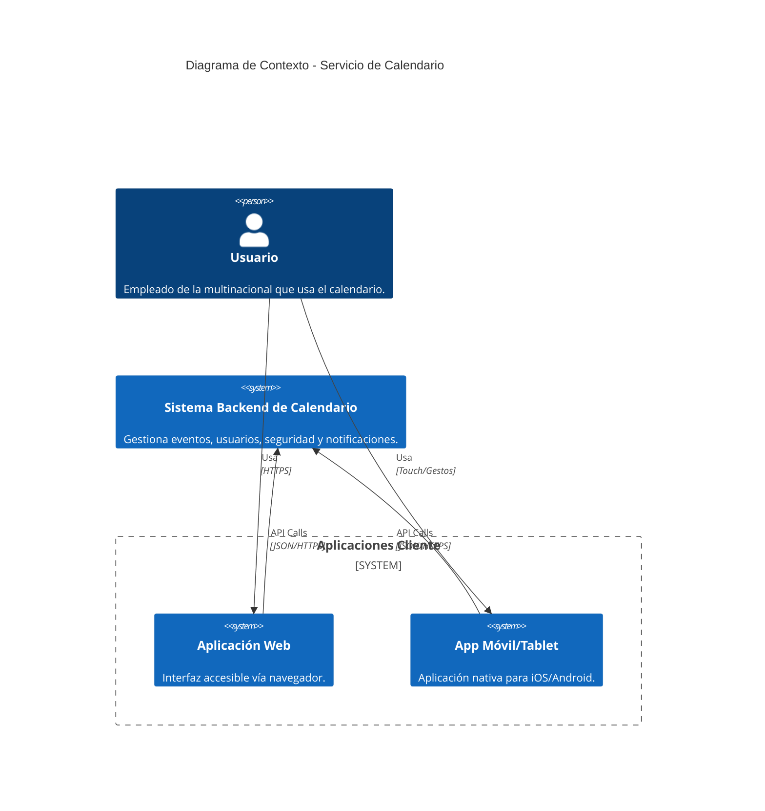
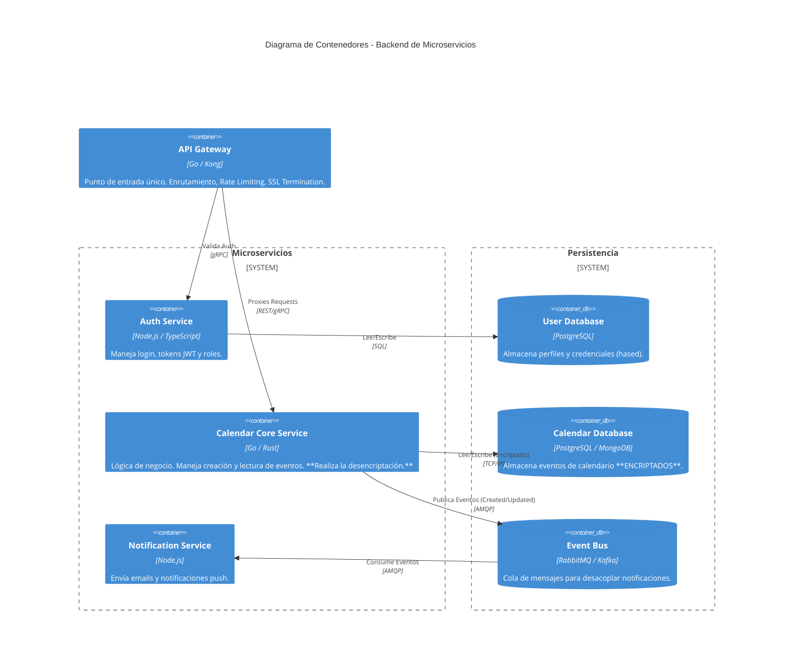
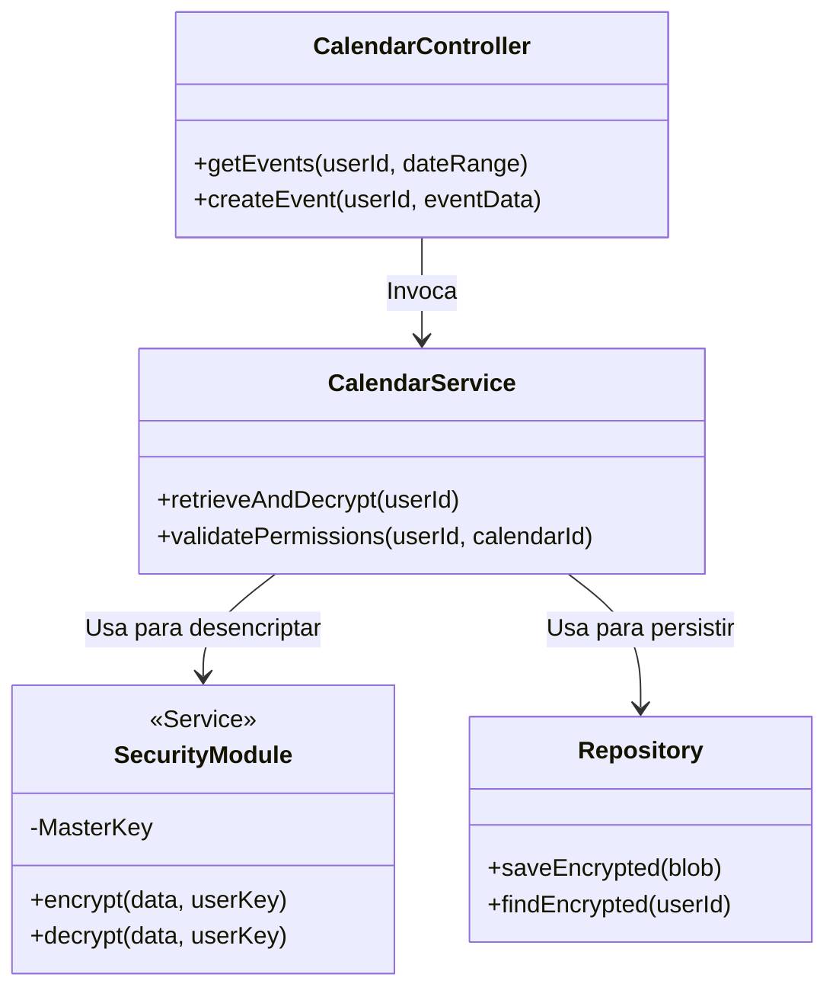
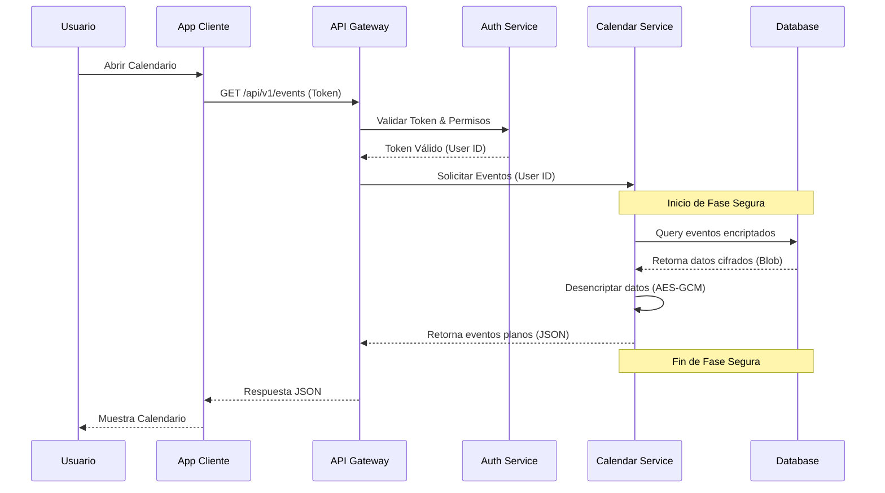

# Diagramas de Arquitectura: Servicio de Calendario

Este documento contiene los diagramas arquitectónicos generados con Mermaid.js para visualizar la estructura y el comportamiento del sistema.

## 1. Diagrama de Contexto del Sistema (System Context)
Muestra cómo los usuarios interactúan con el sistema a través de diferentes plataformas.

## 2. Diagrama de Contenedores (Container Diagram)
Detalla la arquitectura de microservicios propuesta.

## 3. Diagrama de Componentes (Component Diagram)
Enfocado en la estructura interna del servicio de calendario y su módulo de seguridad.

## 4. Diagrama de Secuencia: Flujo de Visualización Seguro
Muestra el proceso crítico de lectura y desencriptación.

