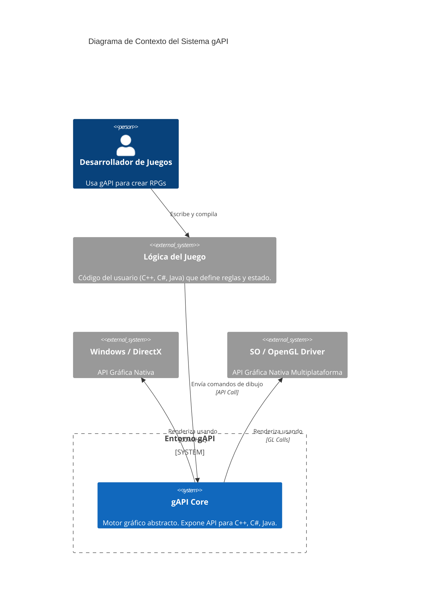
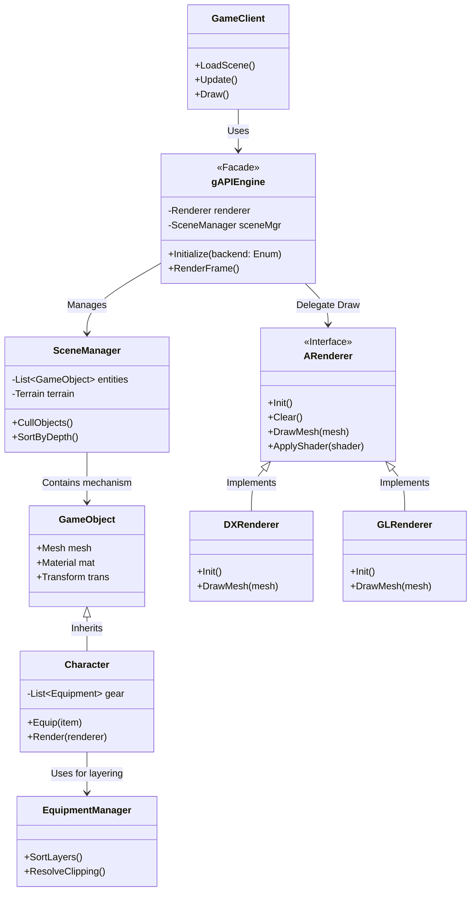
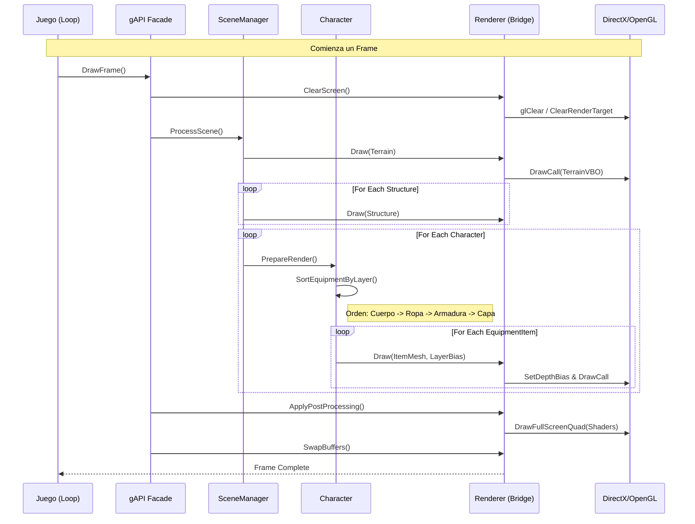

# Diagramas de Arquitectura - gAPI

Este documento contiene los diagramas arquitectónicos generados con Mermaid para visualizar la estructura y comportamiento de gAPI.

## 1. Diagrama de Contexto (C4 Nivel 1)
Muestra cómo gAPI interactúa con el mundo exterior (Juego y Hardware).



## 2. Diagrama de Componentes (Nivel 2)
Detalla los módulos internos de gAPI y su relación implementando el patrón Facade y Bridge.



## 3. Diagrama de Secuencia - Pipeline de Renderizado
Muestra el flujo de ejecución de un frame, desde la llamada del juego hasta la GPU.



## 4. Diagrama de Composición de Equipamiento
Detalla la lógica específica para evitar el clipping mediante capas.

```mermaid
graph TD
    subgraph Character Composition
        C[Character Entity]
        
        subgraph Equipment Layers
            L0[Base Body / Skin]
            L1[Layer 1: Undergarments]
            L2[Layer 2: Armor / Tunic / Clothes]
            L3[Layer 3: Belt / Boots / Gloves]
            L4[Layer 4: Outerwear (Cloaks, Backpacks)]
        end
        
        C -->|Has| L0
        C -->|Has| L1
        C -->|Has| L2
        C -->|Has| L3
        C -->|Has| L4
    end

    subgraph Rendering Logic
        D[Draw Call]
        Z[Z-Buffer Check]
        B[Depth Bias / Stencil]
    end

    L0 -->|Draw First| D
    L1 -->|Draw Second| D
    L2 -->|Draw Third| D
    L3 -->|Draw Fourth| D
    L4 -->|Draw Last| D

    D --> Z
    D -.->|Prevent Z-Fighting| B
    B -->|Offset Z| Z

    style L0 fill:#f9f,stroke:#333
    style L1 fill:#ccf,stroke:#333
    style L2 fill:#99f,stroke:#333
    style L3 fill:#66f,stroke:#333
    style L4 fill:#33f,stroke:#333
```
