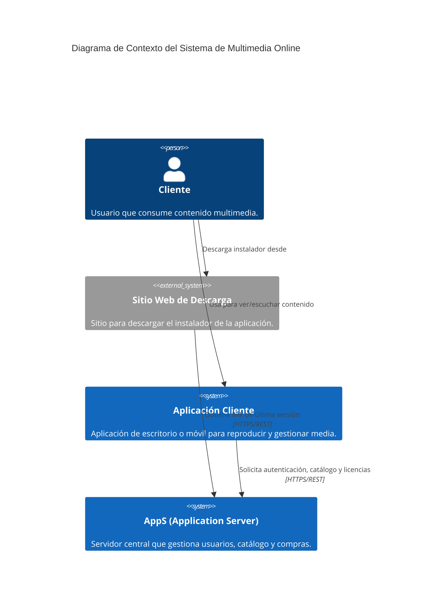
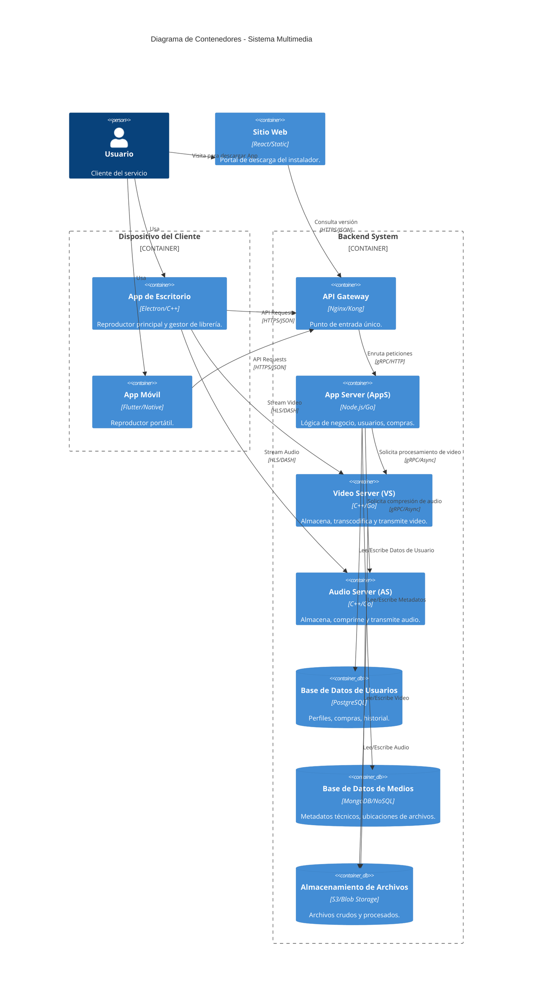
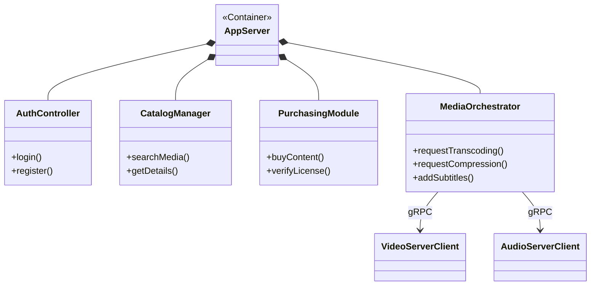

# Diagramas de Arquitectura: Sistema de Reproducción Multimedia Online

## 1. Diagrama de Contexto (C4 Nivel 1)
Muestra las interacciones de alto nivel entre los usuarios y los sistemas principales.



## 2. Diagrama de Contenedores (C4 Nivel 2)
Detalla la arquitectura interna del sistema, separando los servidores de aplicación y medios.



## 3. Diagrama de Componentes: Application Server (AppS) (C4 Nivel 3)
Muestra los módulos internos del servidor de aplicación.



## 4. Diagrama de Componentes: Cliente (Desktop/Mobile)
Muestra la estructura interna de la aplicación cliente y la sincronización.

```mermaid
componentDiagram
    package "Aplicación Cliente" {
        [UI Interfaz de Usuario] as UI
        [Reproductor Multimedia] as Player
        [Gestor de Librería Local] as LibLocal
        [Cliente API Store] as StoreClient
        [Gestor de Descargas] as Downloader
        [Sincronizador USB/Wi-Fi] as Sync
    }

    UI --> Player : Controla
    UI --> LibLocal : Visualiza contenido
    UI --> StoreClient : Navega tienda
    
    StoreClient --> Downloader : Inicia descarga
    Downloader --> LibLocal : Guarda archivo descargado
    
    Sync --> LibLocal : Lee contenido para móvil
    Sync --> MobileDevice : Transfiere archivos (USB/Wi-Fi)
```
