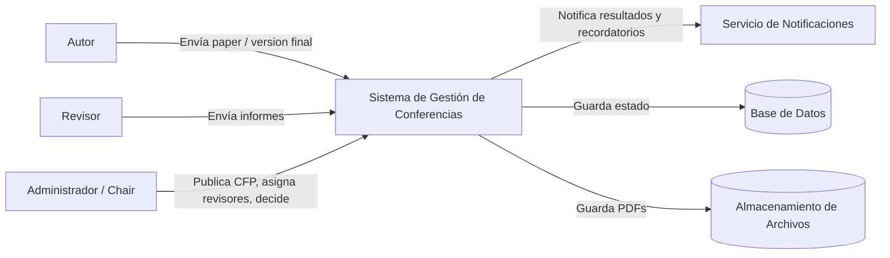
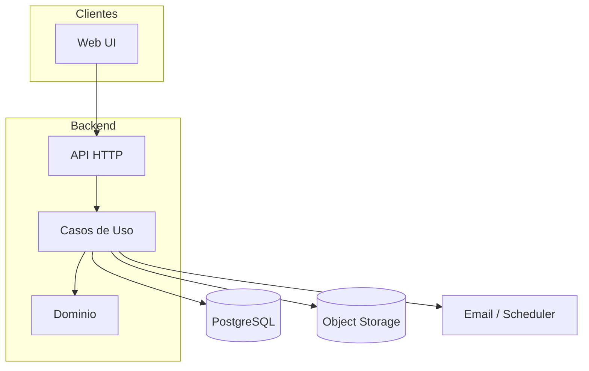
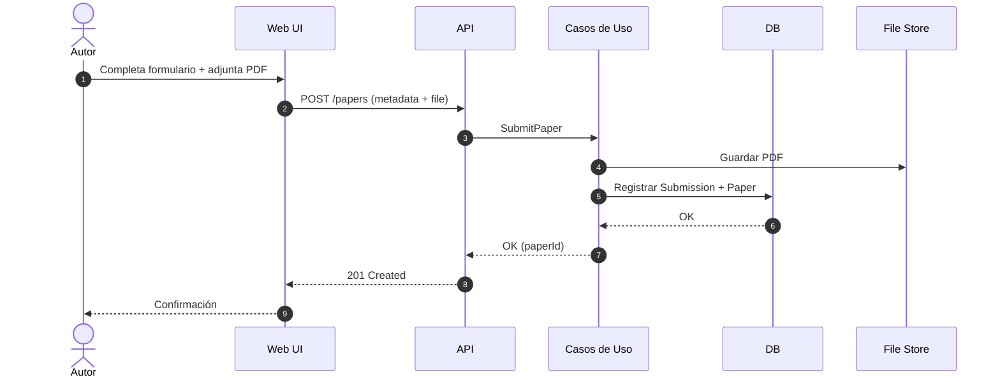
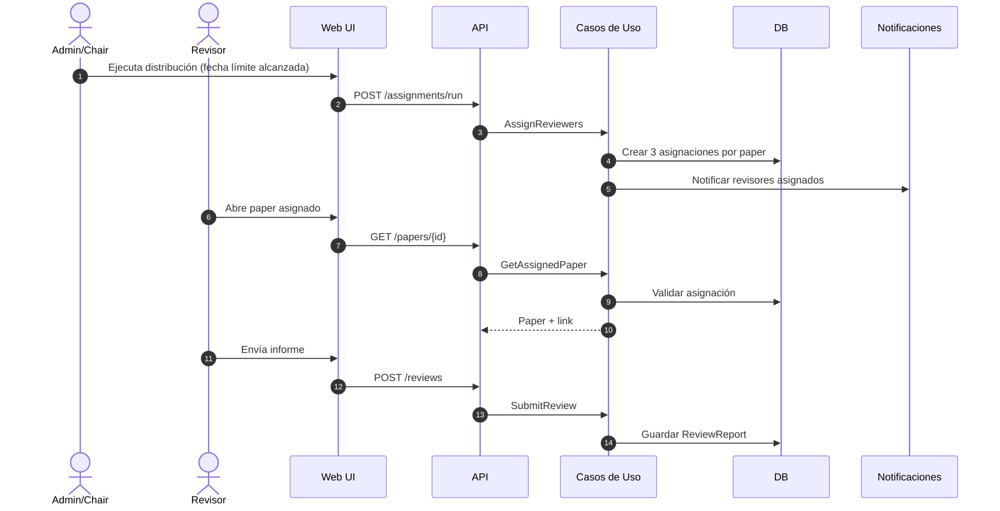
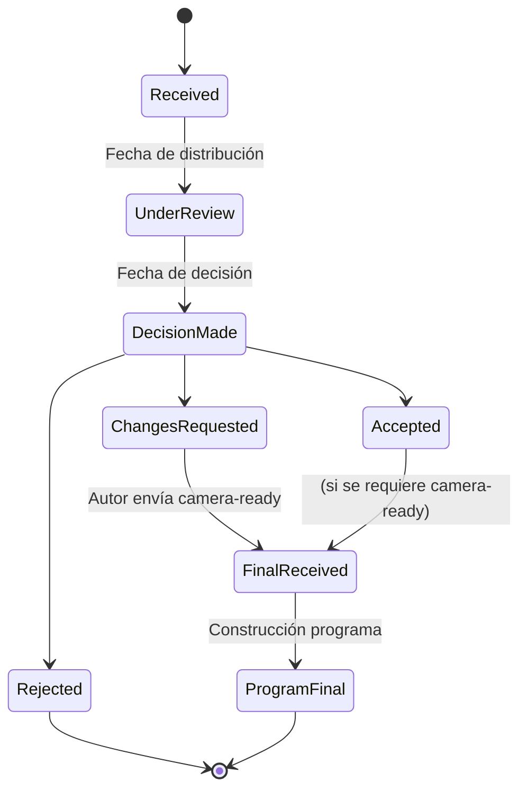

# Diagramas (Mermaid) — Sistema de Gestión de Conferencias

## Contexto (C4 - System Context)

## Contenedores (vista lógica)

## Secuencia — Envío de paper

## Secuencia — Asignación y revisión

## Estado — Ciclo de vida del paper

