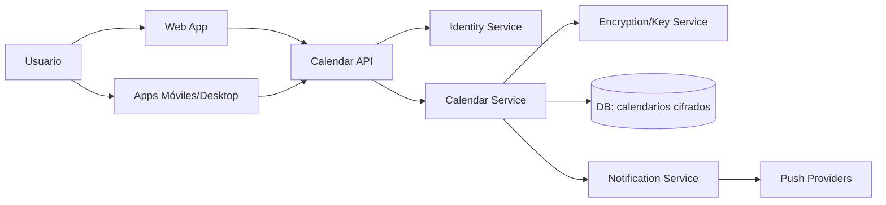
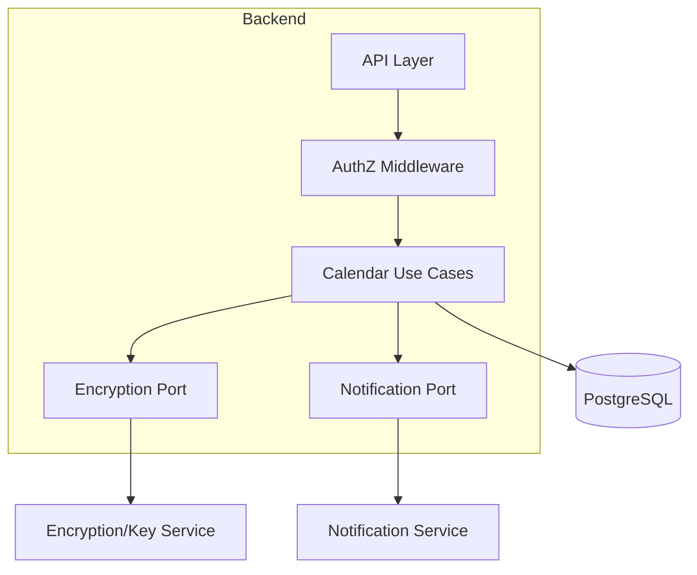
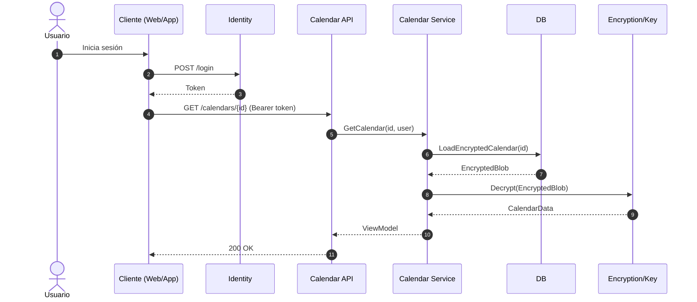
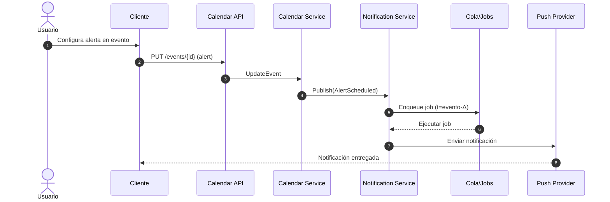

# Diagramas (Mermaid) — Servicio de Calendario

## Contexto

```mermaid
flowchart LR
	User[Usuario] --> Web[Web App]
	User --> Mobile[Apps Móviles/Desktop]

	Web --> API[Calendar API]
	Mobile --> API

	API --> Identity[Identity Service]
	API --> CalendarSvc[Calendar Service]
	CalendarSvc --> Crypto[Encryption/Key Service]
	CalendarSvc --> DB[(DB: calendarios cifrados)]
	CalendarSvc --> NotifSvc[Notification Service]
	NotifSvc --> Push[Push Providers]
```

## Componentes (vista lógica)

```mermaid
flowchart TB
	subgraph Backend
		API[API Layer]
		AuthZ[AuthZ Middleware]
		CalUC[Calendar Use Cases]
		EncPort[Encryption Port]
		NotifPort[Notification Port]
	end

	API --> AuthZ --> CalUC
	CalUC --> EncPort --> Crypto[Encryption/Key Service]
	CalUC --> DB[(PostgreSQL)]
	CalUC --> NotifPort --> Notif[Notification Service]
```

## Secuencia — Ver calendario

```mermaid
sequenceDiagram
	autonumber
	actor Usuario
	participant Client as Cliente (Web/App)
	participant Id as Identity
	participant API as Calendar API
	participant Cal as Calendar Service
	participant DB as DB
	participant KMS as Encryption/Key

	Usuario->>Client: Inicia sesión
	Client->>Id: POST /login
	Id-->>Client: Token

	Client->>API: GET /calendars/{id} (Bearer token)
	API->>Cal: GetCalendar(id, user)
	Cal->>DB: LoadEncryptedCalendar(id)
	DB-->>Cal: EncryptedBlob
	Cal->>KMS: Decrypt(EncryptedBlob)
	KMS-->>Cal: CalendarData
	Cal-->>API: ViewModel
	API-->>Client: 200 OK
```

## Secuencia — Programar y enviar alerta

```mermaid
sequenceDiagram
	autonumber
	actor Usuario
	participant Client as Cliente
	participant API as Calendar API
	participant Cal as Calendar Service
	participant Notif as Notification Service
	participant Queue as Cola/Jobs
	participant Push as Push Provider

	Usuario->>Client: Configura alerta en evento
	Client->>API: PUT /events/{id} (alert)
	API->>Cal: UpdateEvent
	Cal->>Notif: Publish(AlertScheduled)
	Notif->>Queue: Enqueue job (t=evento-Δ)
	Queue-->>Notif: Ejecutar job
	Notif->>Push: Enviar notificación
	Push-->>Client: Notificación entregada
```

