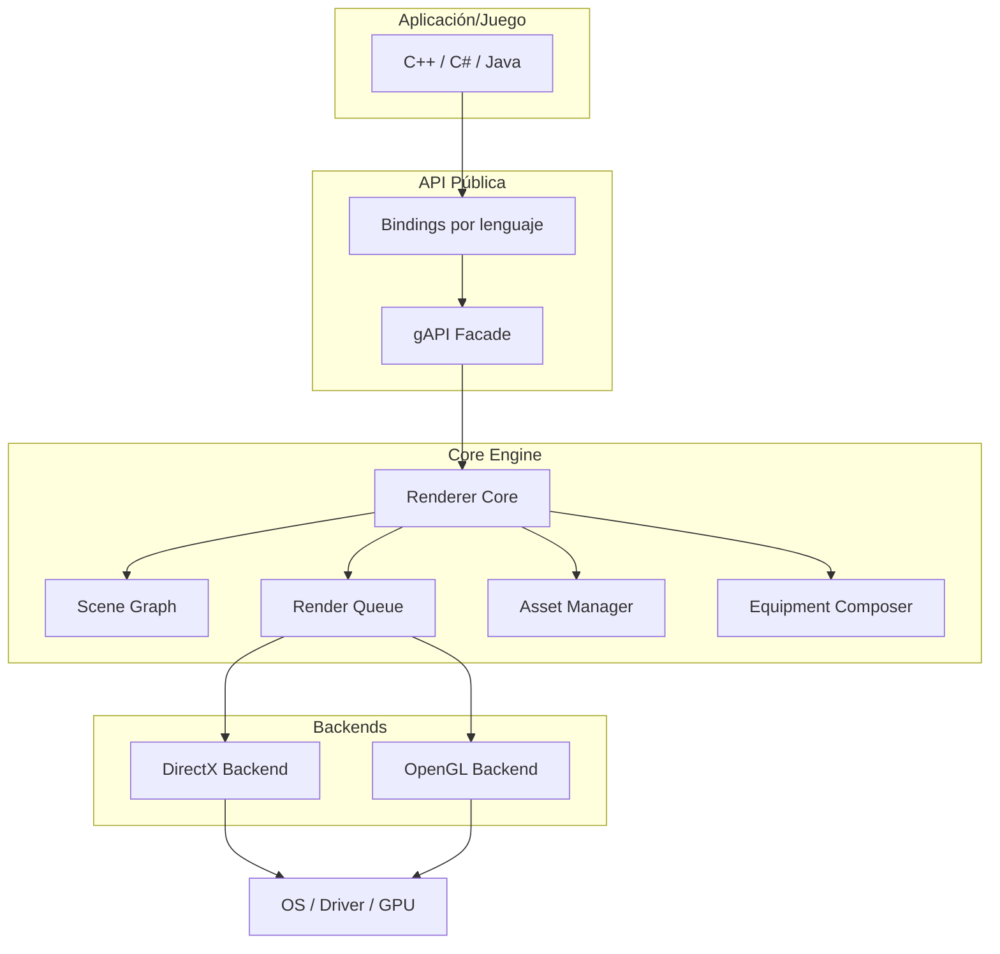
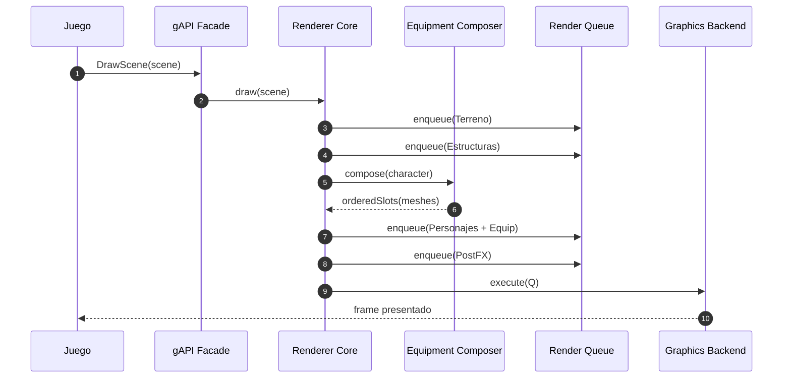
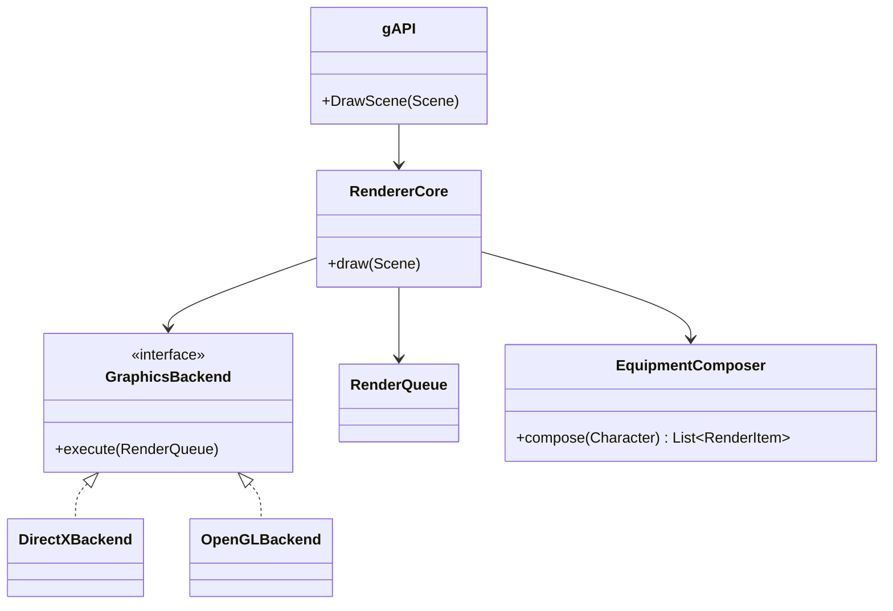

# Diagramas (Mermaid) — gAPI

## Componentes

```mermaid
flowchart TB
	subgraph Game[Aplicación/Juego]
		Code[C++ / C# / Java]
	end

	subgraph PublicAPI[API Pública]
		Bindings[Bindings por lenguaje]
		Facade[gAPI Facade]
	end

	subgraph Engine[Core Engine]
		Scene[Scene Graph]
		Renderer[Renderer Core]
		Queue[Render Queue]
		Assets[Asset Manager]
		Equip[Equipment Composer]
	end

	subgraph Backends[Backends]
		DX[DirectX Backend]
		GL[OpenGL Backend]
	end

	OS[OS / Driver / GPU]

	Code --> Bindings --> Facade --> Renderer
	Renderer --> Scene
	Renderer --> Assets
	Renderer --> Equip
	Renderer --> Queue
	Queue --> DX
	Queue --> GL
	DX --> OS
	GL --> OS
```

## Secuencia — DrawScene

```mermaid
sequenceDiagram
	autonumber
	participant Game as Juego
	participant API as gAPI Facade
	participant Core as Renderer Core
	participant Equip as Equipment Composer
	participant Q as Render Queue
	participant Backend as Graphics Backend

	Game->>API: DrawScene(scene)
	API->>Core: draw(scene)
	Core->>Q: enqueue(Terreno)
	Core->>Q: enqueue(Estructuras)
	Core->>Equip: compose(character)
	Equip-->>Core: orderedSlots(meshes)
	Core->>Q: enqueue(Personajes + Equip)
	Core->>Q: enqueue(PostFX)
	Core->>Backend: execute(Q)
	Backend-->>Game: frame presentado
```

## Clases (simplificado)

```mermaid
classDiagram
	class gAPI {
		+DrawScene(Scene)
	}
	class RendererCore {
		+draw(Scene)
	}
	class GraphicsBackend {
		<<interface>>
		+execute(RenderQueue)
	}
	class DirectXBackend
	class OpenGLBackend
	class RenderQueue
	class EquipmentComposer {
		+compose(Character) List~RenderItem~
	}

	gAPI --> RendererCore
	RendererCore --> RenderQueue
	RendererCore --> GraphicsBackend
	GraphicsBackend <|.. DirectXBackend
	GraphicsBackend <|.. OpenGLBackend
	RendererCore --> EquipmentComposer
```

