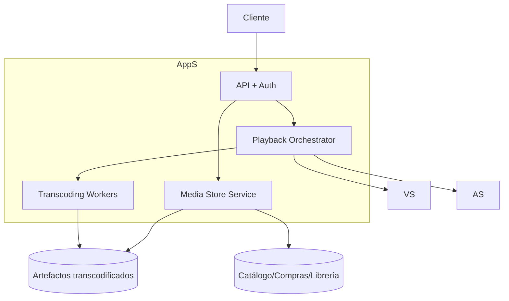
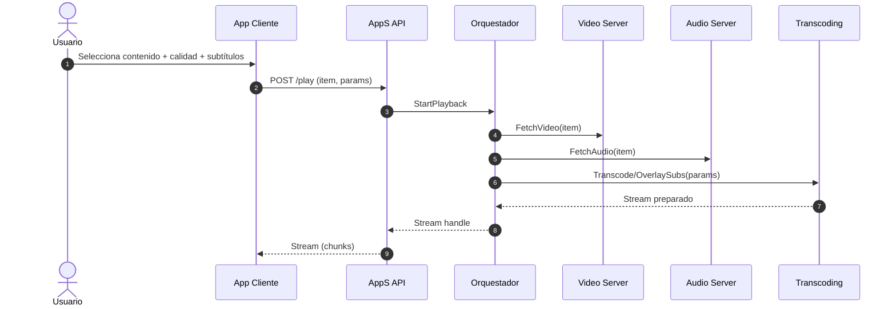
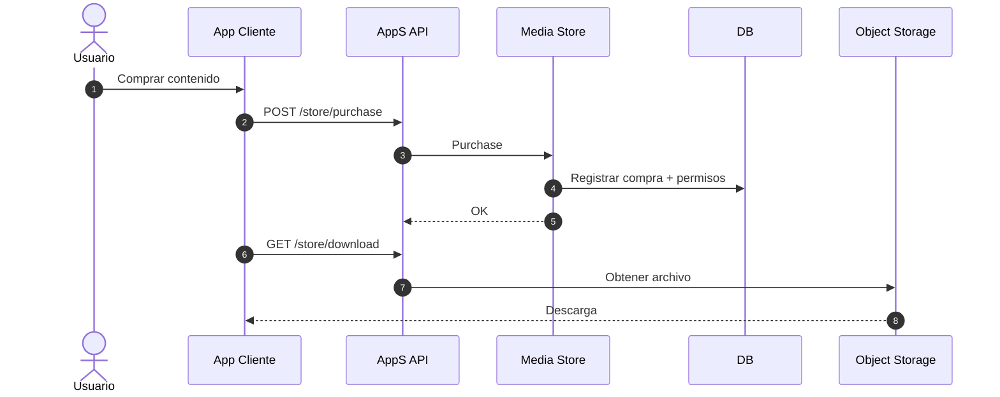

# Diagramas (Mermaid) — Multimedia Online

## Contexto
```mermaid
flowchart LR
	User[Usuario] --> Client[App Cliente]
	User --> Setup[Web Setup]

	Setup --> AppS[AppS]
	Client --> AppS

	AppS --> VS[Video Server (VS)]
	AppS --> AS[Audio Server (AS)]
	AppS --> Store[Media Store (en AppS)]
	AppS --> DB[(DB)]
	AppS --> Obj[(Object Storage)]
```

## Contenedores (AppS)


## Secuencia — Reproducir video con subtítulos


## Secuencia — Compra y descarga


