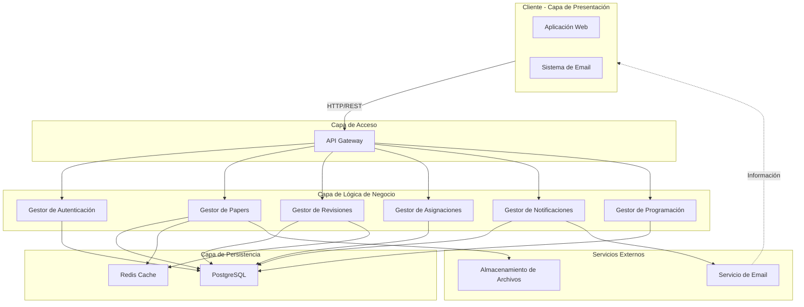

# Arquitectura General del Sistema - Conferencias

## Arquitectura de Capas



## Componentes Principales

| Componente | Responsabilidad | Entidades |
|---|---|---|
| **API Gateway** | Enrutamiento, seguridad, rate limiting | - |
| **Gestor de Autenticación** | Logueo, autorización, validación de roles | Usuario, Rol |
| **Gestor de Papers** | Recepción, validación, almacenamiento | Paper, Autor, Versión |
| **Gestor de Revisiones** | Distribución, recolección de reviews | Review, Evaluación, Estatus |
| **Gestor de Asignaciones** | Asignar papers a revisores | Asignación, Revisor |
| **Gestor de Notificaciones** | Envío de emails y alertas | Notificación, Evento |
| **Gestor de Programación** | Construcción del programa final | Sesión, Horario, Programa |

## Modelos de Datos Clave

```
Usuario
├── id
├── nombre
├── email (único)
├── rol (Admin, Autor, Revisor, Organizador)
└── activo (bool)

Paper
├── id
├── título
├── resumen
├── autores[] (FK Usuario)
├── estado (Enviado, Asignado, En Revisión, Aceptado, Rechazado, Modificaciones Requeridas)
├── archivo_principal (FK Almacenamiento)
├── fecha_envío
└── versión_actual (FK PaperVersión)

PaperVersionión
├── id
├── paper_id (FK)
├── número_versión
├── archivo (FK Almacenamiento)
├── fecha_envío
└── cambios_requeridos (text)

Revisión
├── id
├── paper_id (FK Paper)
├── revisor_id (FK Usuario)
├── calificación (1-10)
├── comentarios (text)
├── recomendación (Aceptar, Rechazar, Modificaciones)
├── fecha_entrega
└── estado (Pendiente, Completada)

Asignación
├── id
├── paper_id (FK Paper)
├── revisor_id (FK Usuario)
├── fecha_asignación
└── fecha_límite

Programa
├── id
├── papers_aceptados[] (FK Paper)
├── sesiones[] (FK Sesión)
├── fecha_generación
└── estado (Borrador, Final)

Sesión
├── id
├── nombre
├── fecha
├── hora_inicio
├── duración
├── papers[] (FK Paper)
└── sala
```
