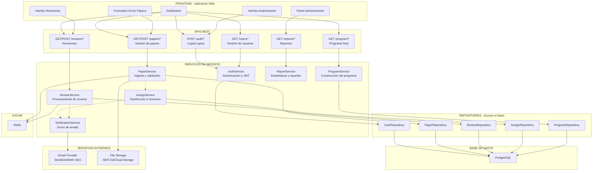

# Diagrama de Componentes

## Componentes del Sistema



## Matriz de Responsabilidades (RACI)

| Entidad | Create | Review | Actualizar | Eliminar |
|---------|--------|--------|------------|----------|
| Paper | Autor | Admin, Revisor | Autor (versiones) | Admin |
| Revisión | Revisor | - | Revisor | Admin |
| Usuario | Admin | - | Admin/self | Admin |
| Asignación | Admin/Sistema | - | Admin | Admin |
| Programa | ProgramService | Admin | Admin/Sistema | Admin |

## Interfaces Principales

### AuthService
```
- login(email, password) → Token JWT
- validateToken(token) → Usuario | null
- logout(token) → void
- assignRole(usuario_id, rol) → void
```

### PaperService
```
- submitPaper(paper, archivo, autor_id) → Paper
- getPapers(filtros) → Paper[]
- getDetailedPaper(paper_id) → Paper + Revisiones
- updatePaperVersion(paper_id, archivo) → PaperVersion
- changePaperStatus(paper_id, nuevoEstado) → void
```

### ReviewService
```
- getPapersToReview(revisor_id) → Paper[]
- submitReview(review_id, calificación, comentarios, recomendación) → Revisión
- getReviewsForPaper(paper_id) → Revisión[]
- calculateDecision(paper_id) → Decisión (Aceptar/Rechazar/Requiere Cambios)
```

### NotificationService
```
- notifySubmissionConfirmed(paper_id) → void
- notifyPaperAssigned(reviewer_id, paper_id) → void
- notifyDecision(author_id, paper_id, decisión) → void
- sendReminderEmail(revisor_id, paper_id) → void
```

### ProgramService
```
- selectAcceptedPapers() → Paper[]
- generateProgram() → Programa
- groupIntoSessions(papers) → Sesión[]
- publishProgram() → void
```
