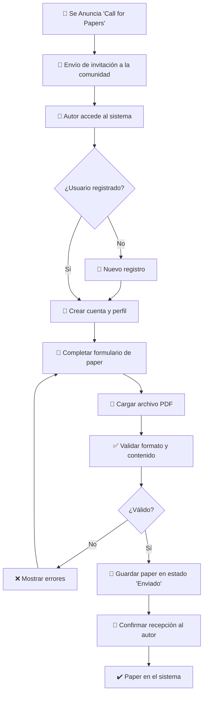
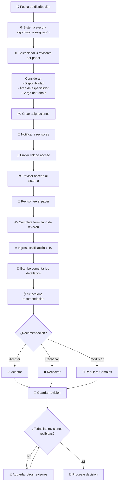
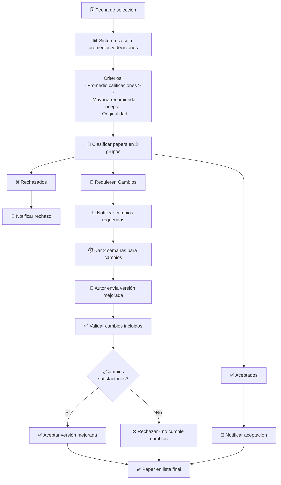
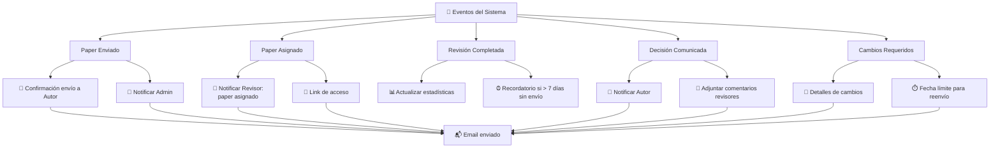
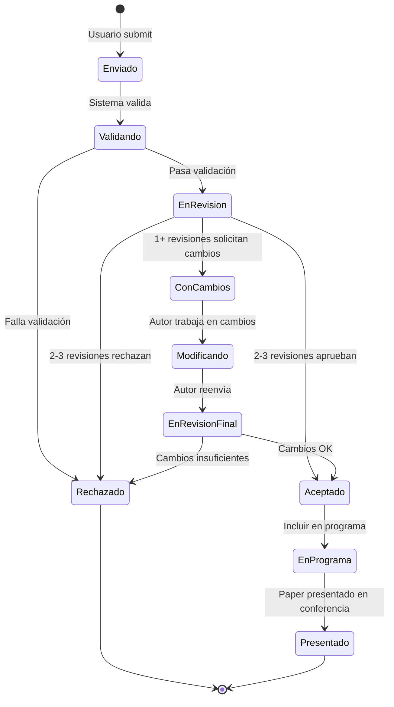

# Diagramas de Flujo de Procesos

## 1. Flujo de Envío de Papers

## 2. Flujo de Distribución y Revisión

## 3. Flujo de Selección de Papers

## 4. Flujo Completo del Sistema (Vista Macro)

```mermaid
flowchart LR
    Phase1["📢 FASE 1<br/>Call for Papers<br/>Duración: 2-4 semanas"] --> |"Autores envían<br/>papers"| Phase2["📥 FASE 2<br/>Recepción<br/>Validación"]
    
    Phase2 --> |"Papers listos<br/>para revisar"| Phase3["🔄 FASE 3<br/>Revisión<br/>_3 revisores/paper<br/>Duración: 3-4 semanas_"]
    
    Phase3 --> |"Todas las reviews<br/>completas"| Phase4["🎯 FASE 4<br/>Selección<br/>Algoritmo de decisión"]
    
    Phase4 --> |"Decisiones<br/>tomadas"| Phase5["📝 FASE 5<br/>Notificación<br/>Cambios requeridos"]
    
    Phase5 --> |"Versiones finales<br/>recibidas"| Phase6["📅 FASE 6<br/>Programación<br/>Construcción agenda"]
    
    Phase6 --> |"Programa<br/>finalizado"| Phase7["🎉 FASE 7<br/>Publicación<br/>Conferencia"]
```

## 5. Flujo de Notificaciones

## 6. Estados y Transiciones de Un Paper

