# Diagramas de Flujo de Procesos

## 1. Flujo de Envío de Papers

```mermaid
flowchart TD
    A["🚀 Se Anuncia 'Call for Papers'"] --> B["📧 Envío de invitación a la comunidad"]
    B --> C["👤 Autor accede al sistema"]
    C --> D{¿Usuario registrado?}
    D -->|No| E["📝 Nuevo registro"]
    E --> F["🔐 Crear cuenta y perfil"]
    D -->|Sí| F
    F --> G["📄 Completar formulario de paper"]
    G --> H["📎 Cargar archivo PDF"]
    H --> I["✅ Validar formato y contenido"]
    I --> J{¿Válido?}
    J -->|No| K["❌ Mostrar errores"]
    K --> G
    J -->|Sí| L["💾 Guardar paper en estado 'Enviado'"]
    L --> M["📧 Confirmar recepción al autor"]
    M --> N["✔️ Paper en el sistema"]
```

## 2. Flujo de Distribución y Revisión

```mermaid
flowchart TD
    A["🗓️ Fecha de distribución"] --> B["⚙️ Sistema ejecuta algoritmo de asignación"]
    B --> C["📊 Seleccionar 3 revisores por paper"]
    C --> D["Considerar:<br/>- Disponibilidad<br/>- Área de especialidad<br/>- Carga de trabajo"]
    D --> E["✉️ Crear asignaciones"]
    E --> F["📧 Notificar a revisores"]
    F --> G["🔗 Enviar link de acceso"]
    
    G --> H["👁️ Revisor accede al sistema"]
    H --> I["📖 Revisor lee el paper"]
    I --> J["✍️ Completa formulario de revisión"]
    J --> K["⭐ Ingresa calificación 1-10"]
    K --> L["💭 Escribe comentarios detallados"]
    L --> M["✋ Selecciona recomendación"]
    M --> N{"¿Recomendación?"}
    N -->|Aceptar| O["✅ Aceptar"]
    N -->|Rechazar| P["❌ Rechazar"]
    N -->|Modificar| Q["🔄 Requiere Cambios"]
    O --> R["💾 Guardar revisión"]
    P --> R
    Q --> R
    R --> S{¿Todas las revisiones<br/>recibidas?}
    S -->|No| T["⏳ Aguardar otros revisores"]
    T --> S
    S -->|Sí| U["🎯 Procesar decisión"]
```

## 3. Flujo de Selección de Papers

```mermaid
flowchart TD
    A["🗓️ Fecha de selección"] --> B["📊 Sistema calcula promedios y decisiones"]
    B --> C["Criterios:<br/>- Promedio calificaciones ≥ 7<br/>- Mayoría recomienda aceptar<br/>- Originalidad"]
    C --> D["🎯 Clasificar papers en 3 grupos"]
    D --> E["✅ Aceptados"]
    D --> F["❌ Rechazados"]
    D --> G["🔄 Requieren Cambios"]
    
    E --> H["📧 Notificar aceptación"]
    F --> I["📧 Notificar rechazo"]
    G --> J["📧 Notificar cambios requeridos"]
    
    J --> K["⏱️ Dar 2 semanas para cambios"]
    K --> L["👤 Autor envía versión mejorada"]
    L --> M["✅ Validar cambios incluidos"]
    M --> N{¿Cambios<br/>satisfactorios?}
    N -->|Sí| O["✅ Aceptar versión mejorada"]
    N -->|No| P["❌ Rechazar - no cumple cambios"]
    
    O --> Q["✔️ Paper en lista final"]
    P --> Q
    H --> Q
```

## 4. Flujo Completo del Sistema (Vista Macro)

```mermaid
flowchart LR
    Phase1["📢 FASE 1<br/>Call for Papers<br/>Duración: 2-4 semanas"] --> |"Autores envían<br/>papers"| Phase2["📥 FASE 2<br/>Recepción<br/>Validación"]
    
    Phase2 --> |"Papers listos<br/>para revisar"| Phase3["🔄 FASE 3<br/>Revisión<br/>_3 revisores/paper<br/>Duración: 3-4 semanas_"]
    
    Phase3 --> |"Todas las reviews<br/>completas"| Phase4["🎯 FASE 4<br/>Selección<br/>Algoritmo de decisión"]
    
    Phase4 --> |"Decisiones<br/>tomadas"| Phase5["📝 FASE 5<br/>Notificación<br/>Cambios requeridos"]
    
    Phase5 --> |"Versiones finales<br/>recibidas"| Phase6["📅 FASE 6<br/>Programación<br/>Construcción agenda"]
    
    Phase6 --> |"Programa<br/>finalizado"| Phase7["🎉 FASE 7<br/>Publicación<br/>Conferencia"]
```

## 5. Flujo de Notificaciones

```mermaid
flowchart TD
    A["🔔 Eventos del Sistema"]
    A --> B["Paper Enviado"]
    A --> C["Paper Asignado"]
    A --> D["Revisión Completada"]
    A --> E["Decisión Comunicada"]
    A --> F["Cambios Requeridos"]
    
    B --> B1["📧 Confirmación envío a Autor"]
    B --> B2["📧 Notificar Admin"]
    
    C --> C1["📧 Notificar Revisor:<br/>paper asignado"]
    C --> C2["📧 Link de acceso"]
    
    D --> D1["📊 Actualizar estadísticas"]
    D --> D2["⏰ Recordatorio si > 7 días sin envío"]
    
    E --> E1["📧 Notificar Autor"]
    E --> E2["📎 Adjuntar comentarios revisores"]
    
    F --> F1["📧 Detalles de cambios"]
    F --> F2["⏱️ Fecha límite para reenvío"]
    
    B1 --> G["📬 Email enviado"]
    B2 --> G
    C1 --> G
    C2 --> G
    E1 --> G
    E2 --> G
    F1 --> G
    F2 --> G
```

## 6. Estados y Transiciones de Un Paper

```mermaid
stateDiagram-v2
    [*] --> Enviado: Usuario submit
    
    Enviado --> Validando: Sistema valida
    Validando --> EnRevision: Pasa validación
    Validando --> Rechazado: Falla validación
    
    EnRevision --> ConCambios: 1+ revisiones solicitan cambios
    EnRevision --> Aceptado: 2-3 revisiones aprueban
    EnRevision --> Rechazado: 2-3 revisiones rechazan
    
    ConCambios --> Modificando: Autor trabaja en cambios
    Modificando --> EnRevisionFinal: Autor reenvía
    EnRevisionFinal --> Aceptado: Cambios OK
    EnRevisionFinal --> Rechazado: Cambios insuficientes
    
    Aceptado --> EnPrograma: Incluir en programa
    EnPrograma --> Presentado: Paper presentado en conferencia
    
    Rechazado --> [*]
    Presentado --> [*]
```

