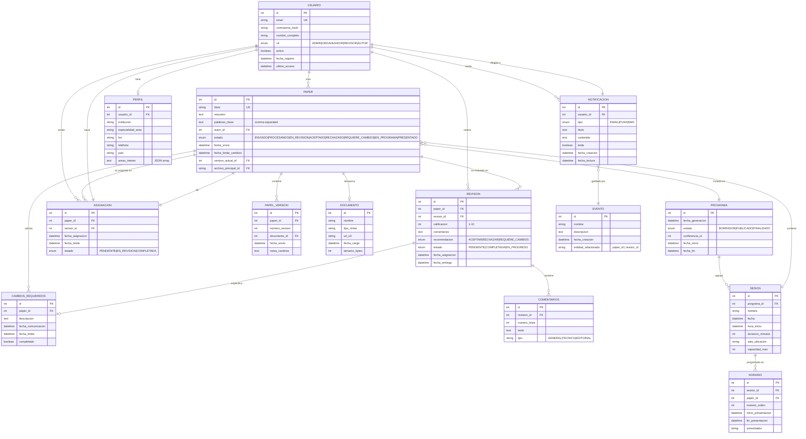

# Diagrama de Relaciones de Datos (ER Diagram)

## Modelo Entidad-Relación Completo



## Tablas Principales y Atributos

### USUARIO
```sql
CREATE TABLE usuario (
    id SERIAL PRIMARY KEY,
    email VARCHAR(255) NOT NULL UNIQUE,
    contrasena_hash VARCHAR(255) NOT NULL,
    nombre_completo VARCHAR(255) NOT NULL,
    rol ENUM('ADMIN', 'ORGANIZADOR', 'REVISOR', 'AUTOR') NOT NULL,
    activo BOOLEAN DEFAULT true,
    fecha_registro TIMESTAMP DEFAULT CURRENT_TIMESTAMP,
    ultimo_acceso TIMESTAMP,
    
    CONSTRAINT chk_email_format CHECK (email ~* '^[A-Za-z0-9._%+-]+@[A-Za-z0-9.-]+\.[A-Z|a-z]{2,}$')
);
```

### PAPEL (Paper)
```sql
CREATE TABLE paper (
    id SERIAL PRIMARY KEY,
    titulo VARCHAR(500) NOT NULL,
    resumen TEXT NOT NULL,
    palabras_clave TEXT,
    autor_id INTEGER NOT NULL REFERENCES usuario(id),
    estado ENUM('ENVIADO', 'PROCESANDO', 'EN_REVISION', 'ACEPTADO', 
                'RECHAZADO', 'REQUIERE_CAMBIOS', 'EN_PROGRAMA', 'PRESENTADO'),
    fecha_envio TIMESTAMP DEFAULT CURRENT_TIMESTAMP,
    fecha_limite_cambios TIMESTAMP,
    version_actual_id INTEGER,
    archivo_principal_id INTEGER REFERENCES documento(id),
    
    CONSTRAINT chk_titulo_length CHECK (char_length(titulo) >= 10),
    CONSTRAINT chk_resumen_length CHECK (char_length(resumen) >= 50)
);
```

### REVISION
```sql
CREATE TABLE revision (
    id SERIAL PRIMARY KEY,
    paper_id INTEGER NOT NULL REFERENCES paper(id),
    revisor_id INTEGER NOT NULL REFERENCES usuario(id),
    calificacion INTEGER CHECK (calificacion BETWEEN 1 AND 10),
    comentarios TEXT NOT NULL,
    recomendacion ENUM('ACEPTAR', 'RECHAZAR', 'REQUIERE_CAMBIOS') NOT NULL,
    estado ENUM('PENDIENTE', 'EN_PROGRESO', 'COMPLETADA') DEFAULT 'PENDIENTE',
    fecha_asignacion TIMESTAMP DEFAULT CURRENT_TIMESTAMP,
    fecha_entrega TIMESTAMP,
    
    UNIQUE(paper_id, revisor_id),
    CONSTRAINT chk_revisor_after_asignacion CHECK (fecha_entrega >= fecha_asignacion)
);
```

### ASIGNACION
```sql
CREATE TABLE asignacion (
    id SERIAL PRIMARY KEY,
    paper_id INTEGER NOT NULL REFERENCES paper(id),
    revisor_id INTEGER NOT NULL REFERENCES usuario(id),
    estado ENUM('PENDIENTE', 'EN_REVISION', 'COMPLETADA') DEFAULT 'PENDIENTE',
    fecha_asignacion TIMESTAMP DEFAULT CURRENT_TIMESTAMP,
    fecha_limite TIMESTAMP NOT NULL,
    
    UNIQUE(paper_id, revisor_id),
    CONSTRAINT chk_limite_futuro CHECK (fecha_limite > fecha_asignacion)
);
```

### PROGRAMA
```sql
CREATE TABLE programa (
    id SERIAL PRIMARY KEY,
    conferencai_id INTEGER,
    fecha_generacion TIMESTAMP DEFAULT CURRENT_TIMESTAMP,
    estado ENUM('BORRADOR', 'PUBLICADO', 'FINALIZADO') DEFAULT 'BORRADOR',
    fecha_inicio DATE NOT NULL,
    fecha_fin DATE NOT NULL,
    
    CONSTRAINT chk_fechas_coherentes CHECK (fecha_fin >= fecha_inicio)
);
```

### SESION
```sql
CREATE TABLE sesion (
    id SERIAL PRIMARY KEY,
    programa_id INTEGER NOT NULL REFERENCES programa(id),
    nombre VARCHAR(255) NOT NULL,
    fecha DATE NOT NULL,
    hora_inicio TIME NOT NULL,
    duracion_minutos INTEGER NOT NULL DEFAULT 120,
    sala_ubicacion VARCHAR(255),
    capacidad_maxima INTEGER,
    
    CONSTRAINT chk_duracion_positiva CHECK (duracion_minutos > 0)
);
```

## Índices para Optimización

```sql
-- Búsquedas frecuentes
CREATE INDEX idx_usuario_email ON usuario(email);
CREATE INDEX idx_usuario_rol ON usuario(rol);

CREATE INDEX idx_paper_autor ON paper(autor_id);
CREATE INDEX idx_paper_estado ON paper(estado);
CREATE INDEX idx_paper_fecha ON paper(fecha_envio DESC);
CREATE INDEX idx_paper_titulo ON paper(titulo);

-- Queries de revisión
CREATE INDEX idx_revision_paper ON revision(paper_id);
CREATE INDEX idx_revision_revisor ON revision(revisor_id);
CREATE INDEX idx_revision_estado ON revision(estado);

-- Asignaciones
CREATE INDEX idx_asignacion_revisor ON asignacion(revisor_id);
CREATE INDEX idx_asignacion_estado ON asignacion(estado);

-- Sesiones y horarios
CREATE INDEX idx_sesion_programa ON sesion(programa_id);
CREATE INDEX idx_sesion_fecha ON sesion(fecha);

-- Índices compuestos para queries complejas
CREATE INDEX idx_revision_paper_revisor ON revision(paper_id, revisor_id, estado);
```

## Consultas Típicas Importantes

### 1. Papers pendientes de revisión de un revisor
```sql
SELECT p.* 
FROM paper p
INNER JOIN asignacion a ON p.id = a.paper_id
WHERE a.revisor_id = $1 
  AND a.estado = 'EN_REVISION'
  AND a.fecha_limite > NOW()
ORDER BY a.fecha_limite ASC;
```

### 2. Calcular decisión de un paper
```sql
SELECT p.id, p.titulo,
    AVG(r.calificacion)::DECIMAL(3,1) as promedio,
    COUNT(CASE WHEN r.recomendacion = 'ACEPTAR' THEN 1 END) as votos_aceptar,
    COUNT(CASE WHEN r.recomendacion = 'RECHAZAR' THEN 1 END) as votos_rechazar,
    COUNT(CASE WHEN r.recomendacion = 'REQUIERE_CAMBIOS' THEN 1 END) as votos_cambios
FROM paper p
LEFT JOIN revision r ON p.id = r.paper_id
WHERE p.id = $1
GROUP BY p.id, p.titulo
HAVING COUNT(r.id) = 3;
```

### 3. Cargas de trabajo de revisores
```sql
SELECT u.nombre_completo, COUNT(a.id) as papers_asignados
FROM usuario u
LEFT JOIN asignacion a ON u.id = a.revisor_id AND a.estado = 'EN_REVISION'
WHERE u.rol = 'REVISOR'
GROUP BY u.id, u.nombre_completo
ORDER BY papers_asignados DESC;
```

### 4. Papers que requieren cambios vencidos
```sql
SELECT p.id, p.titulo, cr.fecha_limite, u.email
FROM paper p
INNER JOIN cambios_requeridos cr ON p.id = cr.paper_id
INNER JOIN usuario u ON p.autor_id = u.id
WHERE cr.completado = false 
  AND cr.fecha_limite < NOW()
ORDER BY cr.fecha_limite ASC;
```
