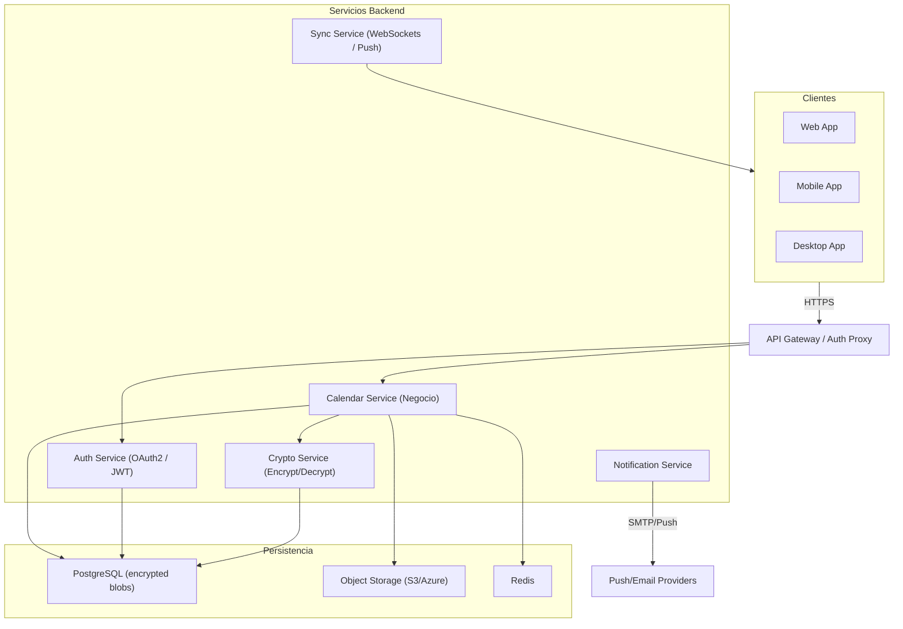

# Arquitectura General — Servicio de Calendario

## Visión general
Servicio de calendario accesible desde web y múltiples aplicaciones (móviles, tablets, desktops). Calendarios cifrados en repositorio y desencriptados bajo permiso.

- Criterios clave: cifrado en reposo, autorización por recurso, sincronización en tiempo real, notificaciones.
- Microservicios recomendados por responsabilidad (Auth, Calendar, Crypto, Notify, Sync).