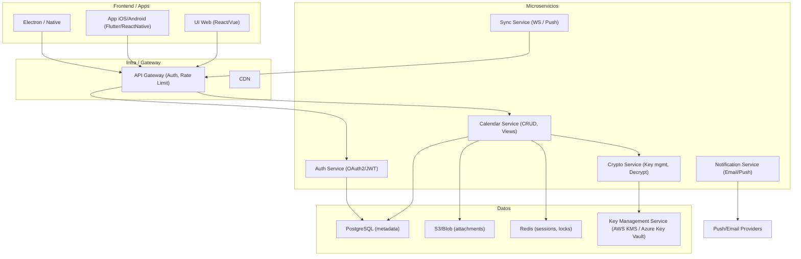

# Diagrama de Componentes — Servicio de Calendario

Responsabilidades principales:
- `Auth`: login, token, MFA opcional.
- `Calendar`: CRUD de calendarios, reglas de permisos, operaciones de vista (desencriptado bajo permiso).
- `Crypto`: gestión de claves, cifrado/descifrado por usuario/objeto.
- `Sync`: mantener vistas actualizadas en múltiples clientes.
- `Notify`: programar y enviar alertas y recordatorios.