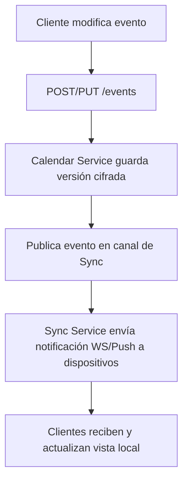

# Diagramas de Flujo — Procesos Clave

## 1) Autenticación y Acceso a Calendario (con desencriptado)

```mermaid
flowchart TD
  A[Usuario solicita acceso] --> B[Login (usuario + contraseña)]
  B --> C{Credenciales válidas}
  C -->|No| D[Denegar acceso]
  C -->|Sí| E[Issue JWT / sesión]
  E --> F[Solicita calendario por ID]
  F --> G[Verificar permisos sobre recurso]
  G -->|No| H[403 Forbidden]
  G -->|Sí| I[Solicitar desencriptado al Crypto Service]
  I --> J[Crypto valida key con KMS]
  J --> K[Crypto devuelve calendar JSON desencriptado]
  K --> L[Calendar Service aplica filtros/transformaciones]
  L --> M[Responder con vista al cliente]
```

## 2) Sincronización entre dispositivos



## 3) Programación de alertas/recordatorios

```mermaid
flowchart TD
  A[Usuario crea alerta] --> B[Store alerta en DB]
  B --> C[Scheduler (cron / Celery-beat)]
  C --> D[Cuando time==alerta.fecha -> Notify Service]
  D --> E[Notify prepara payload (email/push)]
  E --> F[Enviar via proveedor de push/email]
  F --> G[Cliente muestra notificación]
```

## 4) Gestión de claves y encriptado

```mermaid
flowchart TD
  A[Nuevo usuario / nueva clave] --> B[Generar key usuario (KMS)]
  B --> C[Almacenar key en KMS]
  C --> D[Usar key para cifrar calendario antes de persistir]
  D --> E[Guardar blob cifrado en DB/S3]
  
  Note right of D: Las claves nunca salen en texto plano del KMS
```