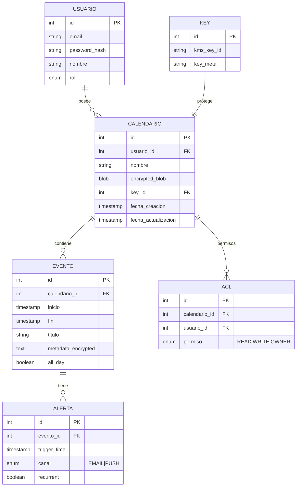

# Esquema de Datos — Calendario Encriptado

- Los calendarios se guardan como blobs cifrados; los metadatos esenciales (owner, timestamps, A CL) están en claro para consultas.
- Las claves son referencias a KMS; nunca almacenar claves en texto plano.

## Índices sugeridos
- `calendario(usuario_id)`
- `evento(calendario_id, inicio)`
- `alerta(trigger_time)`

## Consultas típicas
- Obtener últimos eventos del calendario: paginación por `inicio`.
- Buscar eventos próximos 7 días: index por `inicio`.
