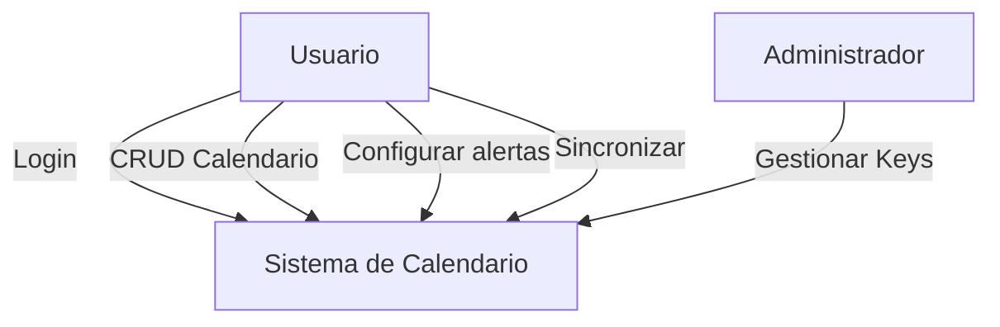
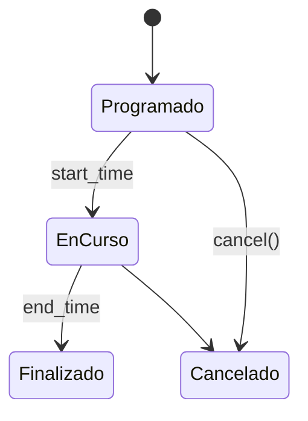

# Patrones de Diseño y Casos de Uso — Servicio de Calendario

## Casos de Uso principales
- Registro / Login (Web & Apps)
- Crear / Editar Calendario
- Compartir calendario (ACL)
- Crear / Editar Evento
- Configurar alertas
- Sincronización multi-dispositivo
- Recuperar calendario desencriptado tras autorización

## Diagrama de Casos de Uso

## Patrones aplicables
- **Strategy**: diferentes algoritmos de sincronización o resolución de conflictos (last-write-wins, merge semántico).
- **Observer / Pub-Sub**: sincronización en tiempo real entre dispositivos mediante eventos publicados por Calendar Service.
- **Facade**: exponer una API simple al cliente que agrupa Auth + Calendar + Crypto.
- **Repository**: abstracción del acceso a datos cifrados.
- **Circuit Breaker / Retry**: resistir caídas de proveedores push/email/KMS.

## Máquina de estados (evento)

## Estrategia de sincronización (alta nivel)
1. Cliente realiza cambio local y lo persiste localmente
2. Envía patch al Calendar Service
3. Calendar Service aplica patch y publica evento de cambio
4. Sync Service propaga cambios a otros dispositivos
5. Clientes aplican patch y actualizan UI

## Reglas de seguridad y privacidad
- Desencriptado sólo en backend si el request proviene de usuario con permiso.
- Para operaciones locales offline, usar key derivada localmente (opcional) para permitir views offline sin enviar clave al servidor.
- Auditoría de accesos y operaciones sensibles.
