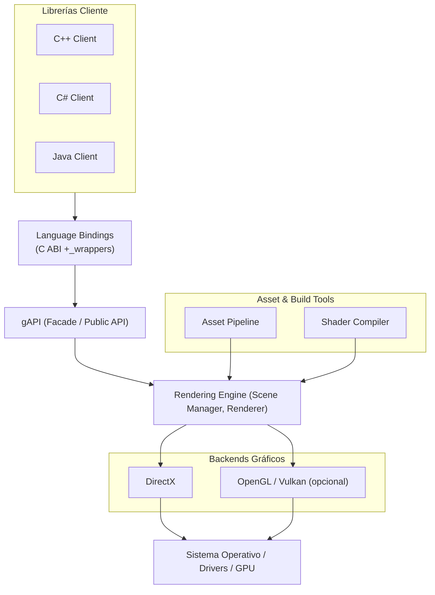

# gAPI — Arquitectura General

Servicio gráfico (gAPI) para exponer una API gráfica estable a C++, C# y Java y traducir peticiones al motor gráfico que usa DirectX o OpenGL.

- Capas: Clientes → Bindings (C ABI) → gAPI (Facade) → Engine → Backend (DirectX/OpenGL) → OS/GPU.
- Principios: API estable (C ABI), mínima dependencia de lenguajes, backend swappable, performance-first.
- Responsabilidad del engine: escena, orden de dibujado, composición de equipamiento, gestión de recursos GPU.
