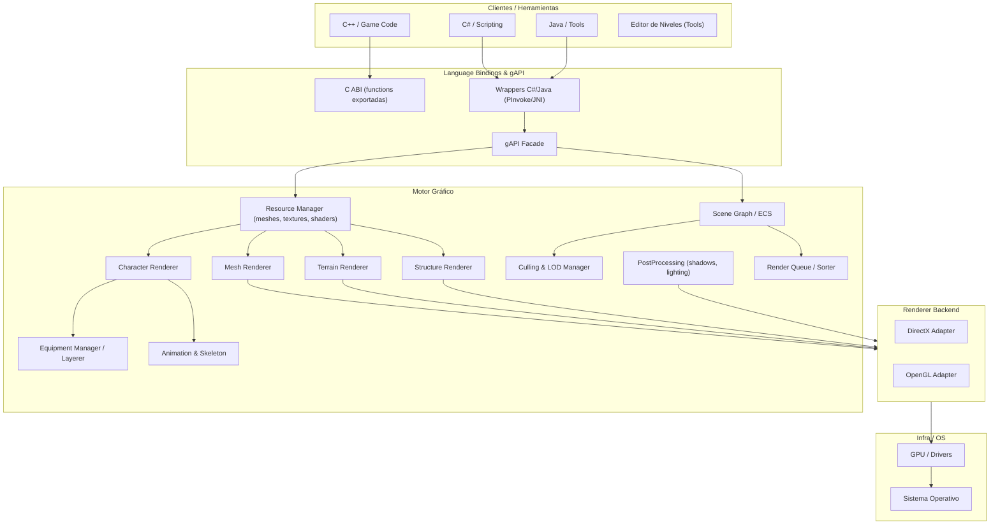

# Diagrama de Componentes — gAPI

- `EquipmentManager` monta los objetos del personaje en orden correcto antes de encolar draw calls.
- `Render Queue` gestiona ordering y batching por materiales/shaders para minimizar cambios de estado.
- `Resource Manager` provee streaming y pooling para meshes/textures/shaders.
