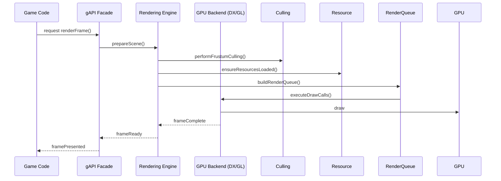

# Pipeline de Render y Orden de Dibujado

## Flujo general del frame

## Orden de dibujado (escena)
1. Terreno
2. Estructuras (static geometry)
3. Personajes (skinned meshes + equipamiento)
4. Objetos estáticos no solapados (instanced)
5. Transparencias / efectos especiales
6. Post-processing (shadows, lighting, tone mapping)

## Estrategia para equipamiento de personajes
- Cada personaje tiene una lista de slots (por ejemplo: Underwear, Armor, Gloves, Boots, Headgear, Tunic, Cape, Belt, Backpack, CapeOverlay).
- `EquipmentManager` construye una lista de meshes a montar respetando prioridad y reglas de ocultación.
- Técnicas para evitar clipping:
  - Orden de render por capas (pintura back-to-front para piezas solapadas no-opacas).
  - Uso de depth bias y alpha testing para bordes finos.
  - Rigging y skinning con weights apropiadas para minimizar interpenetraciones.
  - Opcional: CPU-side mesh merging / baked layers para combinaciones frecuentes.

## Reglas para orden de equipamiento (ejemplo)
- Base (ropa interior) → Ropas → Armadura → Guantes → Calzado → Gorro/Casco → Túnica → Capa → Equipo en Cinto → Equipo en Espalda → CapaFinal
- Piezas con mayor prioridad ocultan a las de menor prioridad si comparten vértices/áreas.

## Optimización de draw calls
- Batch por material/shader
- GPU instancing para objetos repetidos (trees, rocks)
- Merge static geometry donde sea posible
- State sorting: ordenar draw calls por pipeline state para minimizar cambios
- Double/triple buffering y evitar stalls GPU-CPU

## Técnicas de calidad
- OIT (Order-independent transparency) si hay muchas transparencias
- Deferred Shading para escenas con muchas luces dinamicas
- Shadow mapping + cascaded shadow maps
- Screen-space effects (SSAO, SSR) en postfx

## Nota sobre consistencia multiplataforma
- Exponer backend-agnostic resource descriptors (VertexBuffer, IndexBuffer, Shader) y mapear a API nativa en adaptadores
- Evitar comportamientos dependientes de driver; tener validadores de estado para debugging.