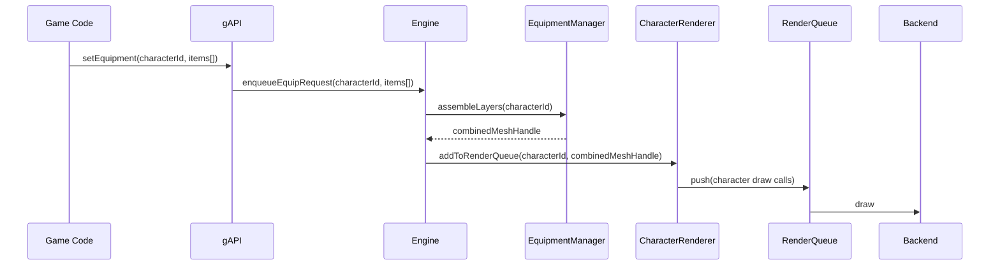

# Patrones de Diseño y Casos de Uso — gAPI

## Patrones relevantes
- **Facade**: `gAPI` expone un API simple que delega a subsistemas internos.
- **Adapter**: adaptadores para DirectX / OpenGL backend.
- **ECS (Entity-Component-System)**: modelar escena y personajes para máxima flexibilidad y rendimiento.
- **Composite / Scene Graph**: representación jerárquica de la escena (transformaciones).
- **Strategy**: estrategias de render (deferred/forward), sorting y equipamiento.
- **Observer / EventBus**: notificaciones (asset loaded, shader compiled).
- **Builder**: construir entidades complejas (personaje + equipamiento).
- **Repository / Resource Manager**: caching y lifetimes de assets.

## Casos de uso principales
1. Renderizar escena completa
   - Input: escena con terrain, estructuras, personajes
   - Output: frame renderizado
2. Equipar personaje
   - Input: lista de items equipados
   - Proceso: `EquipmentManager` resuelve orden y produce meshes instanciados
3. Cambiar backend gráfico
   - Input: request para usar DirectX u OpenGL
   - Proceso: Adapter reemplaza el backend y remapea recursos
4. Cargar assets en runtime
   - Input: paquetes de asset
   - Proceso: Resource Manager stream, validar y notificar

## Diagrama de secuencia: equipar y renderizar personaje

## Reglas de negocio para equipamiento
- Validar compatibilidades (ej: casco vs gorro)
- Resolver occlusions por prioridad y por región de malla
- Políticas de fallback: si pieza no disponible, usar placeholder

## Notas de mantenibilidad
- Separar data-driven rules (orden de capas, compatibilidades) en JSON/asset tables para evolucionar sin recompilar.
- Tests unitarios para `EquipmentManager` y `RenderQueue`.
