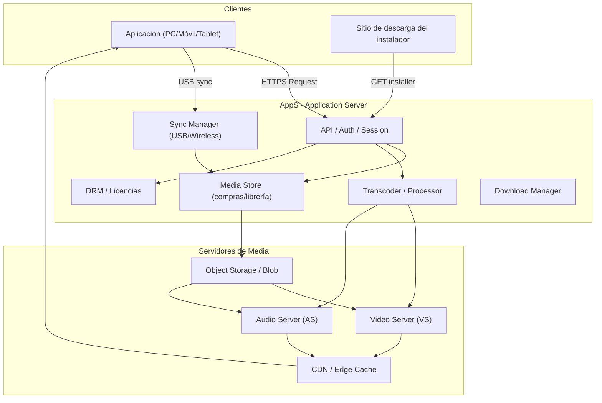

# Arquitectura General — Sistema de Reproducción Multimedia Online

## Visión general
Cliente (app de reproducción) ↔ AppS (Application Server) ↔ Servidor Video (VS) / Servidor Audio (AS) ↔ Almacenamiento/CDN. AppS realiza transcodificación, agregado de subtítulos, compresión de audio y gestión de tienda/media.

Principios: separación de responsabilidades, transcodificación on-demand o pre-transcodificada, CDN para distribución, DRM opcional, soporte offline (descarga a librería).
