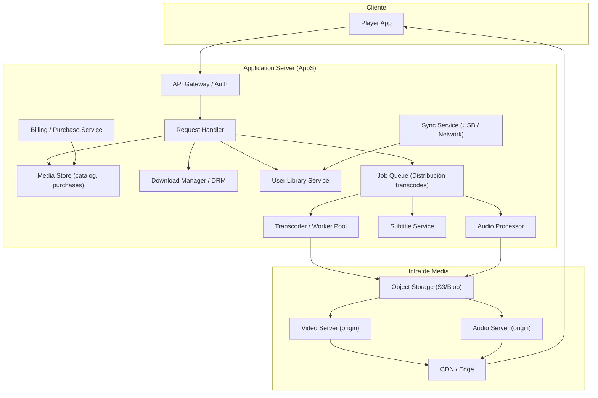

# Diagrama de Componentes — AppS y Servicios

Notas:
- `Jobs` usa broker (RabbitMQ/Kafka) para escalabilidad.
- `Transcoder` puede usar worker autoscaling (FFmpeg containers).
- `DownloadMgr` aplica DRM/licencias y empaqueta descargas para librería offline.
