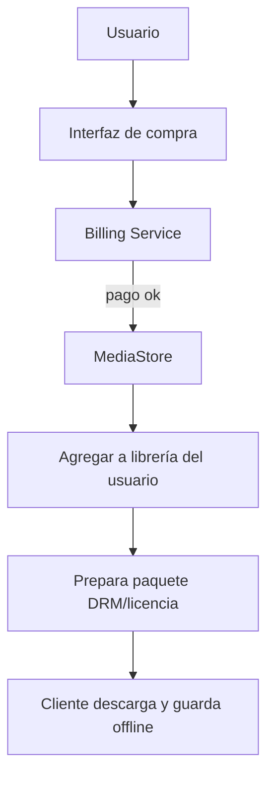
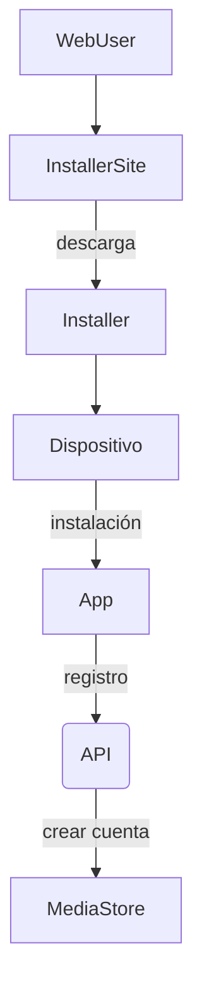
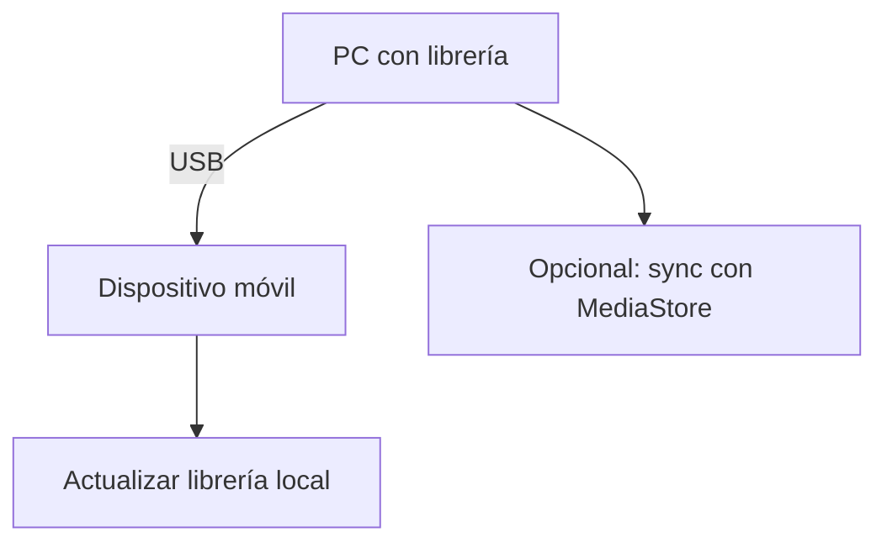

# Flujos de Proceso — Reproducción, Compra y Sync

## 1) Reproducción en Streaming (on-demand)

```mermaid
flowchart TD
  U[Usuario solicita reproducción] --> API[API Gateway]
  API --> Auth[Verificar sesión/permiso]
  Auth -->|ok| RH[Request Handler]
  RH --> CheckCache{¿Edge/Cache contiene asset?}
  CheckCache -->|Sí| CDN[Redirigir a CDN]
  CheckCache -->|No| Origin[Solicitar origen (VS/AS)]
  Origin -->|Puede pre-transcodificado| CDN
  Origin -->|Si no| Jobs[Crear job de transcodificación]
  Jobs --> Transcoder
  Transcoder --> Storage
  Storage --> CDN
  CDN --> App
```

## 2) Compra y descarga a la librería



## 3) Instalador y registro



## 4) Sincronización de librería (USB)

