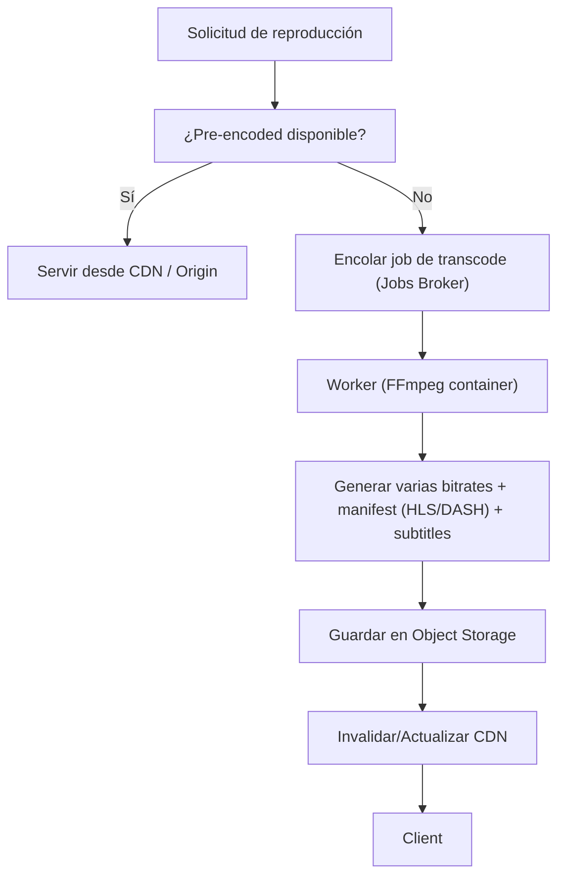

# Pipeline de Transcodificación y Streaming

## Opciones de entrega
- Streaming adaptativo: HLS o MPEG-DASH
- Descarga: paquetes DRM-encrypted para librería offline

## Flujo de transcodificación (on-demand vs pre-encode)

## Segmentación y ABR
- Generar segmentos de duración fija (2-6s)
- Manifest que referencia variantes (1080p, 720p, 480p, audio-only)
- Client adapta bitrate según throughput

## Subtítulos & Closed Captions
- Storage de pistas VTT/TTML separadas
- Transcoder puede "burn-in" subtítulos si solicita el cliente

## Audio Processing
- Recompresión (AAC/Opus) y normalización loudness
- Generar versiones stereo/mono y diferentes bitrates

## Latencia y performance
- Para live/low-latency emplear CMAF + chunked transfer
- Escalar workers horizontalmente; usar pre-warming para assets populares

## DRM / Licencias
- Integrar con DRM provider (Widevine/PlayReady/ FairPlay)
- Licencias expiran según política de compra

## Consideraciones de fiabilidad
- Retries y backoff en workers
- Monitorización de queue depth y tiempos de transcode
- TTL y purgado de versiones antiguas si espacio limitado
