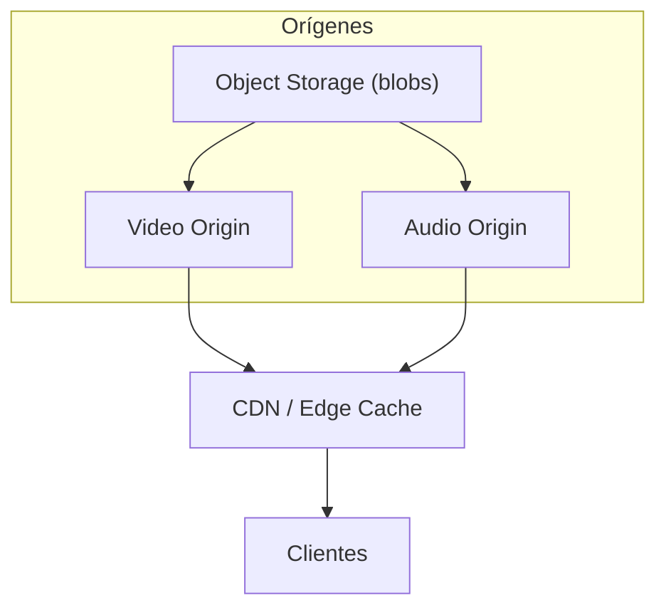

# Almacenamiento y CDN

## Arquitectura de almacenamiento
- Object Storage (S3 / Azure Blob) como origen
- CDN (Edge) para distribuir segmentos y paquetes descargables
- Metadata y catálogo en base de datos relacional/NoSQL (Postgres / DynamoDB)

## Estrategias de almacenamiento
- Pre-encode assets populares en varias calidades
- Cache-control y versionado de manifests
- Purga basada en LRU + políticas de coste
- Backup y replicación geo

## Seguridad y acceso
- Signed URLs para recursos privados
- Tokens temporales para CDN
- Logging de accesos y uso para billing

## Integración con AppS
- AppS orquesta pre-encode y genera signed URLs
- MediaStore guarda referencias y políticas de licencia
