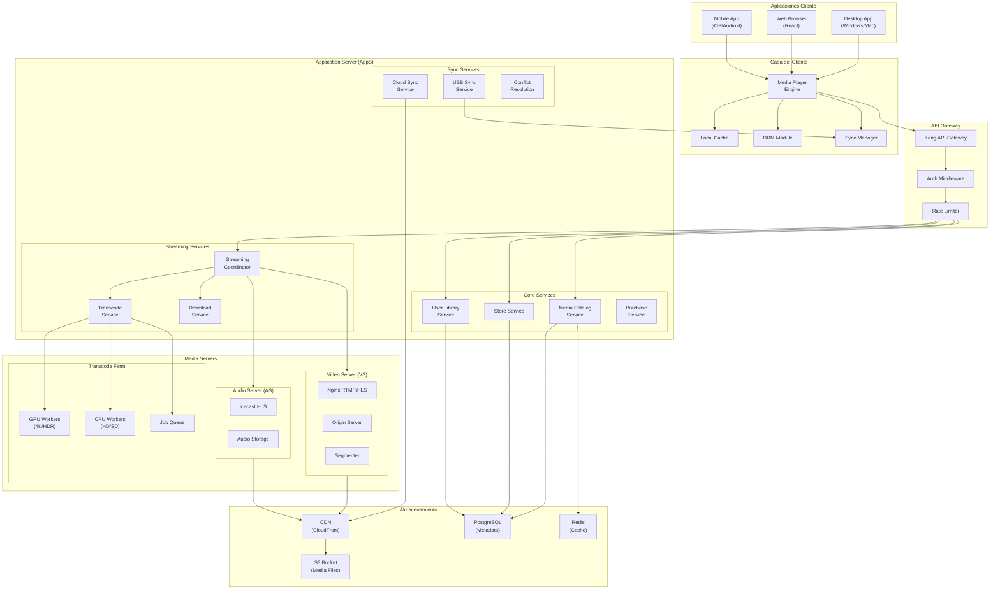
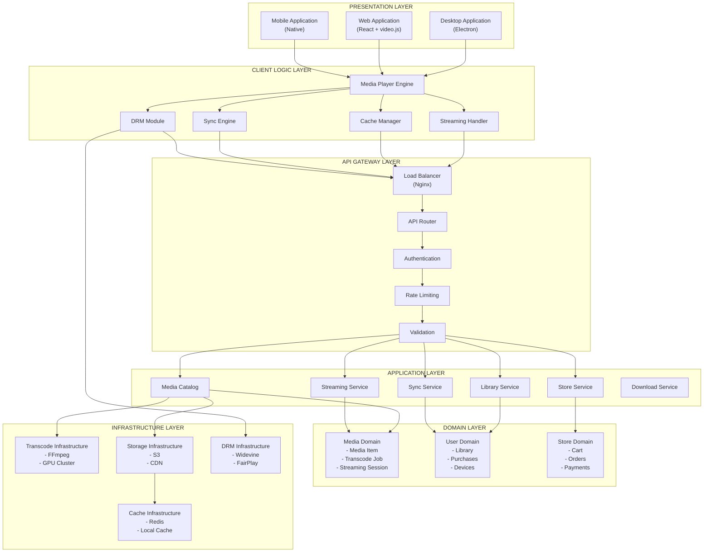
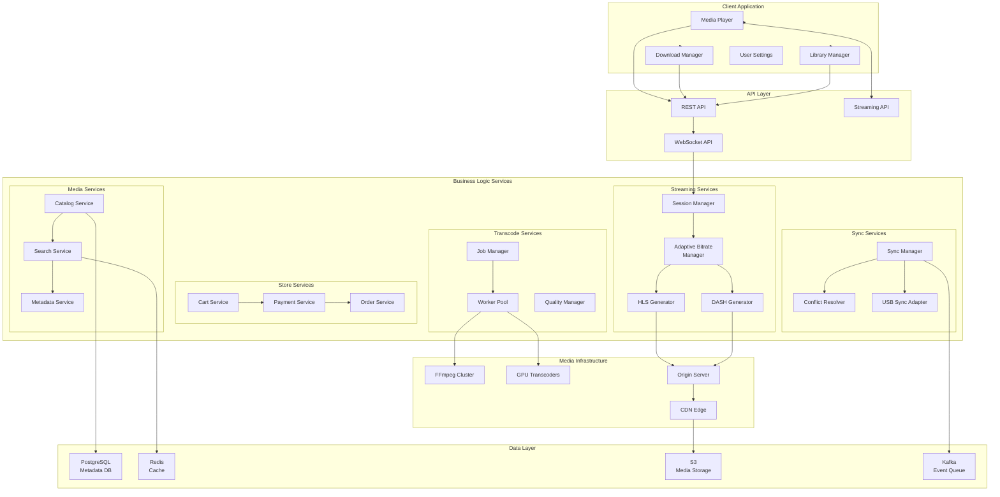
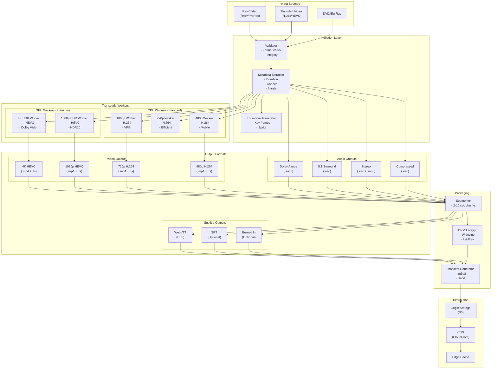
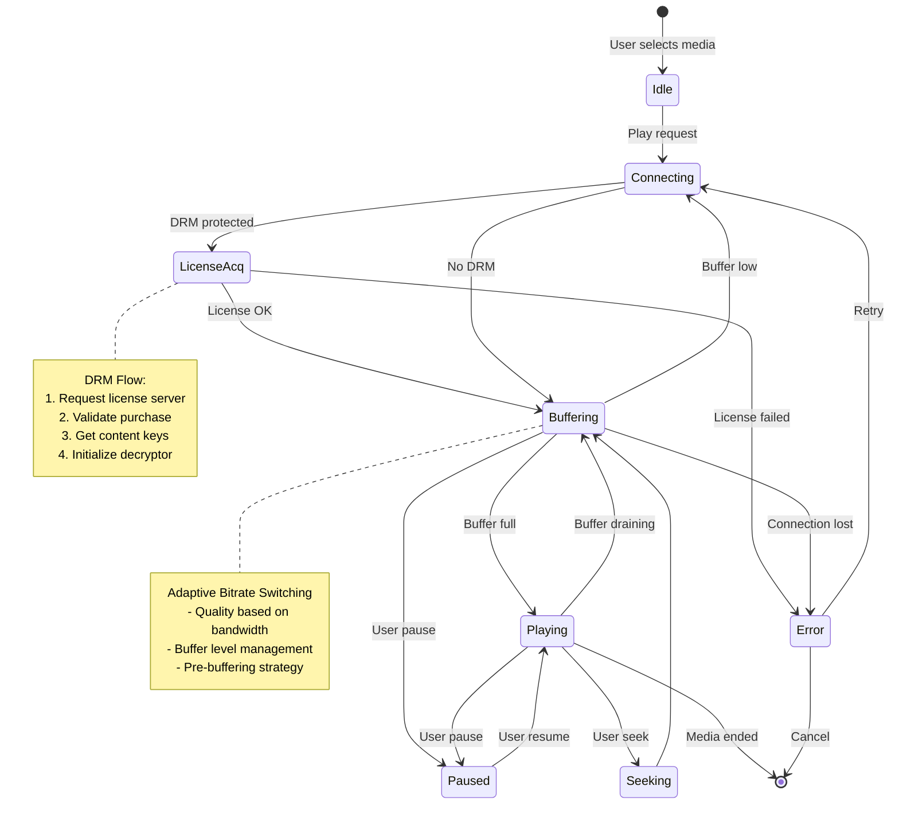
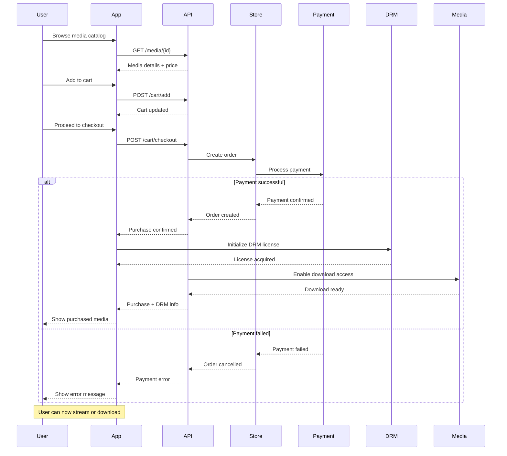
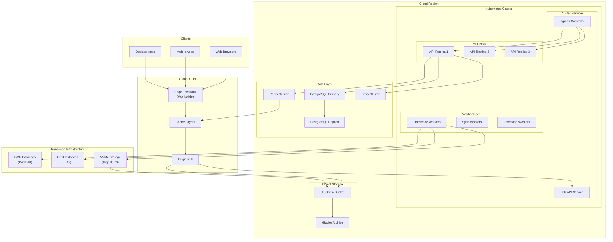

# Diagramas de Arquitectura - Sistema de Reproducción de Multimedia Online

## 1. Diagrama de Arquitectura General del Sistema



---

## 2. Diagrama de Arquitectura de Capas



---

## 3. Diagrama de Componentes del Sistema



---

## 4. Diagrama de Pipeline de Transcodificación



---

## 5. Diagrama de Estados de Streaming



---

## 6. Diagrama de Sincronización entre Dispositivos

```mermaid
flowchart TB
    subgraph Cloud["Cloud Sync Architecture"]
        CloudDB["Cloud Library DB"]
        SyncQueue["Sync Queue\n(Kafka)"]
        ConflictRes["Conflict Resolver"]
        StateMgr["State Manager"]
    end

    subgraph Device1["Dispositivo 1 (PC)"]
        LocalDB1["Local Library DB"]
        SyncAgent1["Sync Agent"]
        Storage1["Local Storage\n(Downloaded)"]
    end

    subgraph Device2["Dispositivo 2 (Mobile)"]
        LocalDB2["Local Library DB"]
        SyncAgent2["Sync Agent"]
        Storage2["Local Storage\n(Downloaded)"]
    end

    subgraph Device3["Dispositivo 3 (USB)"]
        USBStorage["USB Storage\n(Dump)"]
        USBSync["USB Sync Protocol"]
    end

    %% Flujo Cloud Sync
    SyncAgent1 --> SyncQueue: Push changes
    SyncQueue --> StateMgr: Process events
    StateMgr --> CloudDB: Update cloud state
    StateMgr --> SyncAgent2: Notify changes
    
    %% Conflict Resolution
    SyncAgent1 --> ConflictRes: Conflict detected
    ConflictRes --> StateMgr: Resolve & update
    StateMgr --> SyncAgent1: Resolved state
    StateMgr --> SyncAgent2: Resolved state

    %% USB Sync
    SyncAgent1 --> USBSync: Export to USB
    USBSync --> USBStorage: Write media files
    USBStorage --> USBSync: File list + metadata
    
    USBSync --> SyncAgent2: Import from USB
    SyncAgent2 --> LocalDB2: Merge library
    LocalDB2 --> Storage2: Copy media files
    
    %% Metadata sync
    LocalDB1 --> SyncAgent1: Check metadata
    SyncAgent1 --> StateMgr: Get latest state
    StateMgr --> LocalDB1: Sync metadata
    
    LocalDB2 --> SyncAgent2: Check metadata
    SyncAgent2 --> StateMgr: Get latest state
    StateMgr --> LocalDB2: Sync metadata
```

---

## 7. Diagrama de Base de Datos (ER)

```mermaid
erDiagram
    USERS ||--o{ PURCHASES : buys
    USERS ||--o{ LIBRARIES : owns
    USERS ||--o{ DEVICES : registers
    USERS ||--o{ PLAYLISTS : creates
    
    LIBRARIES ||--o{ LIBRARY_ITEMS : contains
    LIBRARIES ||--o{ DOWNLOADS : has
    DEVICES ||--o{ DOWNLOADS : stores
    
    MEDIA_ITEMS ||--o{ TRANSCODES : has
    MEDIA_ITEMS ||--o{ STREAM_SESSIONS : streamed
    PLAYLISTS ||--o{ PLAYLIST_ITEMS : includes
    
    DOWNLOADS ||--o{ SYNC_TASKS : synced
    
    USERS {
        uuid id PK
        string email
        string password_hash
        string subscription_type
        datetime created_at
        datetime last_login
        jsonb preferences
    }
    
    MEDIA_ITEMS {
        uuid id PK
        string title
        string type  -- VIDEO or AUDIO
        string genre
        integer duration_seconds
        jsonb metadata
        string thumbnail_url
        uuid uploader_id
        datetime released_at
        decimal price
        boolean is_explicit
        jsonb drm_info
    }
    
    TRANSCODES {
        uuid id PK
        uuid media_item_id FK
        string quality  -- 4K, 1080p, 720p, 480p
        string format  -- mp4, webm, ts
        string codec  -- hevc, h264, vp9
        integer bitrate
        string url
        integer file_size
    }
    
    LIBRARIES {
        uuid id PK
        uuid user_id FK
        string name
        datetime created_at
        datetime updated_at
    }
    
    LIBRARY_ITEMS {
        uuid id PK
        uuid library_id FK
        uuid media_item_id FK
        datetime added_at
        string playback_position
        boolean is_favorite
        jsonb user_data
    }
    
    DOWNLOADS {
        uuid id PK
        uuid library_item_id FK
        uuid device_id FK
        string quality
        string format
        string local_path
        datetime downloaded_at
        integer progress
        enum status
    }
    
    DEVICES {
        uuid id PK
        uuid user_id FK
        string device_name
        enum device_type
        string os_version
        datetime last_active
        string device_token
        integer max_storage
    }
    
    PLAYLISTS {
        uuid id PK
        uuid user_id FK
        string name
        string description
        boolean is_public
        datetime created_at
    }
    
    PLAYLIST_ITEMS {
        uuid id PK
        uuid playlist_id FK
        uuid media_item_id FK
        integer position
        datetime added_at
    }
    
    STREAM_SESSIONS {
        uuid id PK
        uuid media_item_id FK
        uuid user_id FK
        uuid device_id FK
        string quality
        string transcoded_url
        datetime started_at
        datetime ended_at
        integer bytes_streamed
    }
    
    PURCHASES {
        uuid id PK
        uuid user_id FK
        uuid media_item_id FK
        decimal amount
        string currency
        string payment_method
        datetime purchased_at
        string transaction_id
    }
```

---

## 8. Diagrama de Flujo de Compra



---

## 9. Diagrama de Streaming HLS/DASH

```mermaid
flowchart TB
    subgraph Client["Client Player"]
        Player["Video.js / Native Player"]
        ABR["ABR Controller"]
        Buffer["Buffer Manager"]
        DRMDecrypt["DRM Decryptor"]
    end

    subgraph Request["HTTP Requests"]
        MasterM3U8["GET /master.m3u8"]
        QualM3U8["GET /1080p.m3u8"]
        TSChunks["GET /segment1.ts"]
        KeyFile["GET /encryption.key"]
    end

    subgraph Server["CDN / Origin"]
        MasterPlaylist["Master Playlist\n.m3u8"]
        QualityPlaylists["Quality Playlists\n.m3u8 per quality"]
        Segments["TS Segments\n(2-10 seconds)"]
        KeyStore["DRM Key Store"]
    end

    %% Flujo de streaming
    Player --> ABR: User starts playback
    
    ABR --> MasterM3U8: Request master playlist
    MasterM3U8 --> Player: Return manifest
    
    Player --> ABR: Select quality based on bandwidth
    
    ABR --> QualM3U8: Request quality playlist
    QualM3U8 --> Player: Return segments list
    
    loop Playback loop
        Player --> Buffer: Request segment
        Buffer --> TSChunks: Fetch segment
        TSChunks --> Buffer: Segment data
        Buffer --> DRMDecrypt: Decrypt with key
        DRMDecrypt --> KeyFile: Request DRM key (if needed)
        KeyFile --> DRMDecrypt: Return key
        DRMDecrypt --> Player: Render frame
    end
    
    ABR --> Buffer: Monitor buffer level
    Buffer --> ABR: Report status
    
    ABR --> QualM3U8: Switch quality (up/down)
    QualM3U8 --> ABR: New segment list
    
    note right of ABR
        Adaptive Bitrate Logic:
        - High bandwidth → Switch to higher quality
        - Low bandwidth → Switch to lower quality
        - Buffer draining → Buffer more
        - Buffer full → Higher quality
    end note
```

---

## 10. Diagrama de Despliegue



---

## 11. Diagrama de Arquitectura DRM

```mermaid
flowchart TB
    subgraph ContentPrep["Content Preparation"]
        RawMedia["Raw Media File"]
        Encryptor["DRM Encryptor\n(Widevine/FairPlay)"]
        KeyServer["Key Server"]
        Packager["Content Packager"]
    end

    subgraph License["License Server"]
        AuthService["Auth Service"]
        PolicyEngine["Policy Engine"]
        KeyVault["Key Vault\n(Hardware Security)"]
        LicenseDB["License Database"]
    end

    subgraph Client["Client Device"]
        DRMModule["DRM Module"]
        LicenseReq["License Request"]
        Decryptor["Content Decryptor"]
        Player["Media Player"]
    end

    subgraph Distribution["Content Distribution"]
        CDN["CDN"]
        EncryptedContent["Encrypted Media\n(.mp4 + .ts)"]
        Manifests["DRM Manifests\n(.m3u8 + .key)"]
    end

    %% Flujo de preparación
    RawMedia --> Encryptor: Encrypt content
    Encryptor --> KeyServer: Request content key
    KeyServer --> KeyVault: Generate key
    KeyVault --> KeyServer: Return key
    KeyServer --> Encryptor: Content key + KID
    Encryptor --> Packager: Encrypted segments
    Packager --> Manifests: Generate manifest with KID
    Packager --> EncryptedContent: Segmented + encrypted
    
    EncryptedContent --> CDN
    Manifests --> CDN
    
    %% Flujo de licencia
    Player --> DRMModule: Initialize playback
    DRMModule --> LicenseReq: Build license request
    LicenseReq --> AuthService: Send license request
    
    AuthService --> PolicyEngine: Validate request
    PolicyEngine --> LicenseDB: Check entitlements
    LicenseDB -->> PolicyEngine: User permissions
    
    PolicyEngine --> KeyVault: Get content key
    KeyVault -->> PolicyEngine: Wrapped key
    
    PolicyEngine --> LicenseDB: Record license grant
    PolicyEngine -->> AuthService: License response
    
    AuthService -->> LicenseReq: License (encrypted key)
    LicenseReq -->> Decryptor: Decrypt content key
    Decryptor -->> Player: Decoded frames
```

---

## 12. Diagrama de Comparación de Protocolos de Streaming

```mermaid
flowchart LR
    subgraph Protocols["Streaming Protocols"]
        HLS["HLS\nHTTP Live Streaming"]
        DASH["DASH\nDynamic Adaptive Streaming"]
        RTMP["RTMP\nReal-Time Messaging"]
        WebRTC["WebRTC"]
        Progresive["Progressive Download"]
    end
    
    subgraph Characteristics["Characteristics"]
        subgraph Latency["Latency"]
            HighLat["10-30s\n(HLS/DASH)"]
            MedLat["2-5s\n(RTMP)"]
            LowLat["<1s\n(WebRTC)"]
        end
        
        subgraph Compatibility["Browser Compatibility"]
            WideComp["HLS/DASH\n(All modern browsers)"]
            LimitedComp["RTMP\n(Legacy only)"]
            RealTimeComp["WebRTC\n(Real-time apps)"]
        end
        
        subgraph Adaptive["Adaptive Bitrate"]
            ABR_HLS["HLS: Yes\n(.m3u8 playlists)"]
            ABR_DASH["DASH: Yes\n(.mpd manifest)"]
            ABR_RTMP["RTMP: No"]
            ABR_WebRTC["WebRTC: Limited"]
        end
        
        subgraph DRM["DRM Support"]
            DRM_HLS["HLS: Yes\n(Widevine/FairPlay)"]
            DRM_DASH["DASH: Yes\n(Widevine/PlayReady)"]
            DRM_RTMP["RTMP: Limited"]
            DRM_WebRTC["WebRTC: Yes\n(Encrypted extensions)"]
        end
    end
    
    %% Conexiones
    HLS --> HighLat
    HLS --> WideComp
    HLS --> ABR_HLS
    HLS --> DRM_HLS
    
    DASH --> HighLat
    DASH --> WideComp
    DASH --> ABR_DASH
    DASH --> DRM_DASH
    
    RTMP --> MedLat
    RTMP --> LimitedComp
    RTMP --> ABR_RTMP
    RTMP --> DRM_RTMP
    
    WebRTC --> LowLat
    WebRTC --> RealTimeComp
    WebRTC --> ABR_WebRTC
    WebRTC --> DRM_WebRTC
    
    Progresive --> HighLat
    Progresive --> WideComp
    Progresive --> ABR_WebRTC
    Progresive --> DRM_HLS
    
    note right of HLS
        RECOMMENDED:
        Primary: HLS + DASH
        Fallback: Progressive
    end note
```
