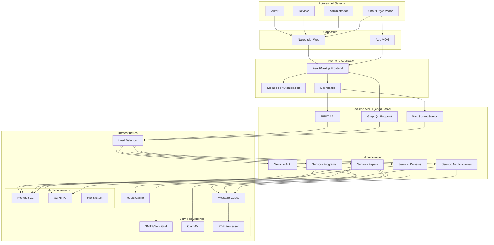
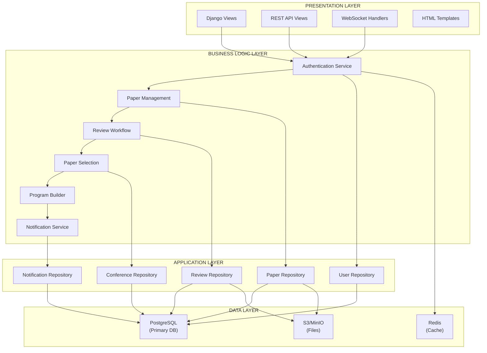
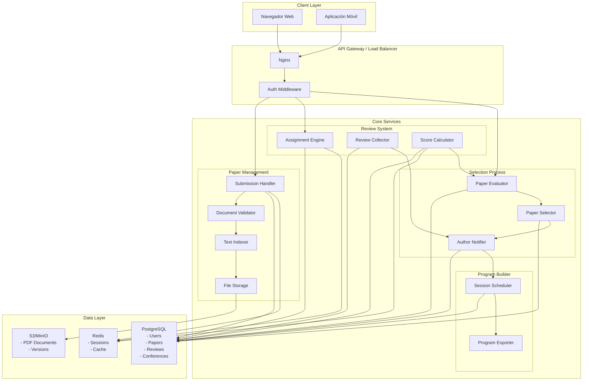
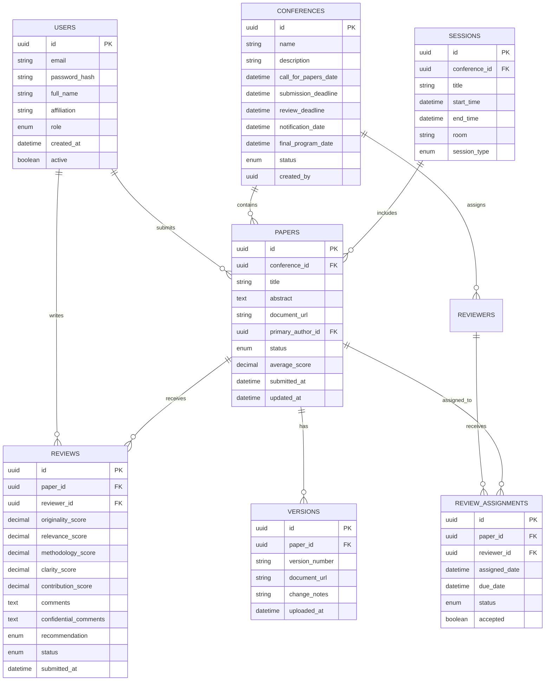
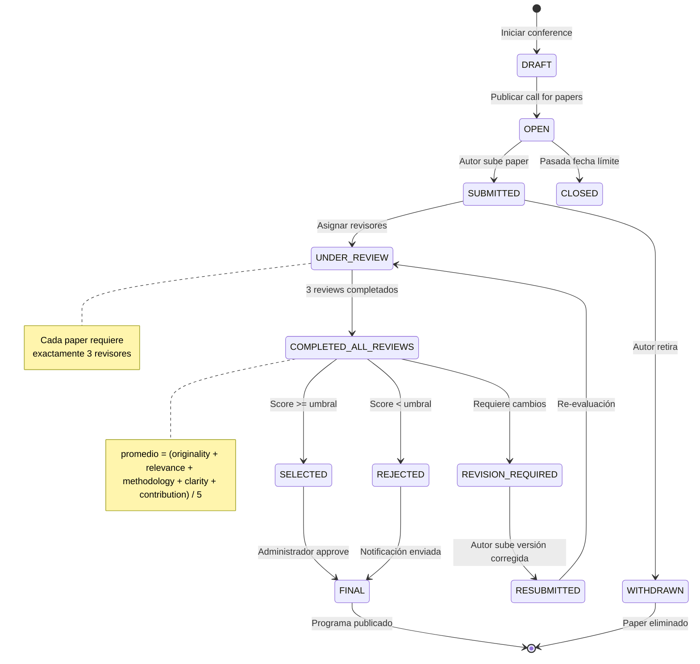
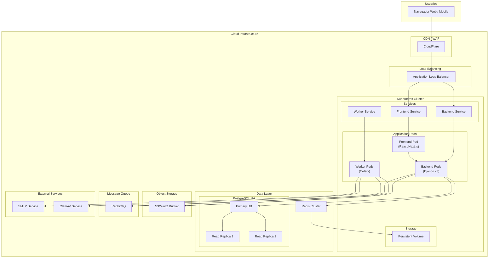
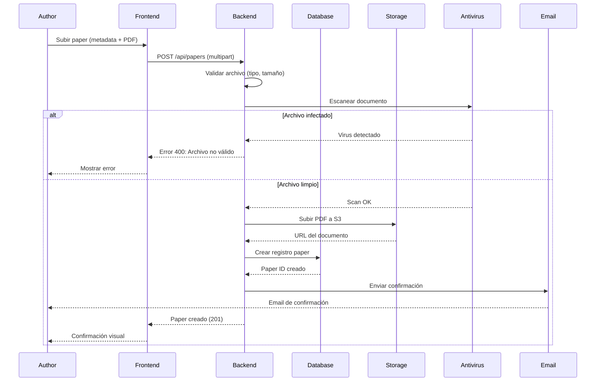
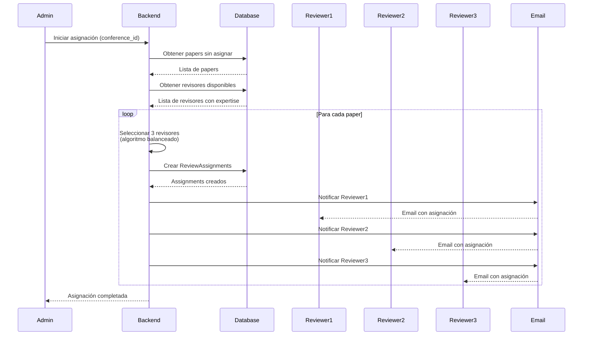

# Diagramas de Arquitectura - Sistema de Gestión de Conferencias

## 1. Diagrama de Arquitectura General (C4 Model - Container)



---

## 2. Diagrama de Arquitectura de Capas (Layered Architecture)



---

## 3. Diagrama de Componentes del Sistema



---

## 4. Diagrama de Arquitectura de Base de Datos



---

## 5. Diagrama de Flujo de Estados (State Machine)



---

## 6. Diagrama de Flujo de Procesos (Business Process)

```mermaid
flowchart TD
    Start([Inicio del Proceso])
    
    subgraph CFP["Call for Papers"]
        A1[Crear conferencia]
        A2[Configurar fechas]
        A3[Publicar CFP]
    end
    
    subgraph Submission["Submisión de Papers"]
        B1[Autor registra datos]
        B2[Sube documento PDF]
        B3[Valida formato]
        B4[Registra submission]
        B5[Envía confirmación]
    end
    
    subgraph Assignment["Asignación de Revisores"]
        C1[Identificar papers pendientes]
        C2[Seleccionar revisores por expertise]
        C3[Asignar 3 revisores/paper]
        C4[Notificar revisores]
    end
    
    subgraph Review["Proceso de Revisión"]
        D1[Revisor acepta asignación]
        D2[Descarga paper]
        D3[Completa evaluación]
        D4[Envía review]
        D5[Actualizar score promedio]
    end
    
    subgraph Selection["Selección Final"]
        E1[Calcular scores finales]
        E2[Aplicar criterios selección]
        E3[Revisión administrativa]
        E4[Notificar resultados]
    end
    
    subgraph Final["Versión Final"]
        F1[Autores con revisiones suben versiones]
        F2[Admin aprueba versiones finales]
        F3[Generar programa]
        F4([Fin del proceso])
    end
    
    Start --> A1
    A1 --> A2
    A2 --> A3
    A3 --> B1
    
    B1 --> B2
    B2 --> B3
    B3 --> B4
    B4 --> B5
    B5 --> C1
    
    C1 --> C2
    C2 --> C3
    C3 --> C4
    C4 --> D1
    
    D1 --> D2
    D2 --> D3
    D3 --> D4
    D4 --> D5
    D5 --> E1
    
    E1 --> E2
    E2 --> E3
    E3 --> E4
    E4 --> F1
    
    F1 --> F2
    F2 --> F3
    F3 --> F4
```



---

## 7. Diagrama de Despliegue (Deployment)



---

## 8. Diagrama de Secuencia - Submisión de Paper



---

## 9. Diagrama de Secuencia - Asignación de Revisores



---

## 10. Diagrama de Componentes - Patrón Observer para Notificaciones

```mermaid
flowchart TB
    subgraph Subject["Subject (Paper/Observable)"]
        PaperSubject["Paper Service"]
        Events["Event Bus"]
    end

    subgraph Observers["Observers (Subscribers)"]
        EmailNotif["Email Notification Service"]
        Webhook["Webhook Dispatcher"]
        Audit["Audit Logger"]
        Dashboard["Dashboard Updater"]
    end

    subgraph Events["Event Types"]
        PaperSubmitted["paper.submitted"]
        ReviewAssigned["review.assigned"]
        ReviewCompleted["review.completed"]
        PaperSelected["paper.selected"]
        PaperRejected["paper.rejected"]
        FinalVersion["paper.final_version"]
    end

    %% Flujo
    PaperSubject --> Events: Publica evento
    
    Events --> EmailNotif: Suscrito a todos
    Events --> Webhook: Suscrito a eventos relevantes
    Events --> Audit: Todos los eventos
    Events --> Dashboard: Actualizaciones de estado
    
    EmailNotif --> Author: Email
    EmailNotif --> Reviewer: Email
    
    Webhook --> ExternalSystems: HTTP callbacks
    
    Audit --> Database: Guardar logs
    
    Dashboard --> Frontend: WebSocket update
