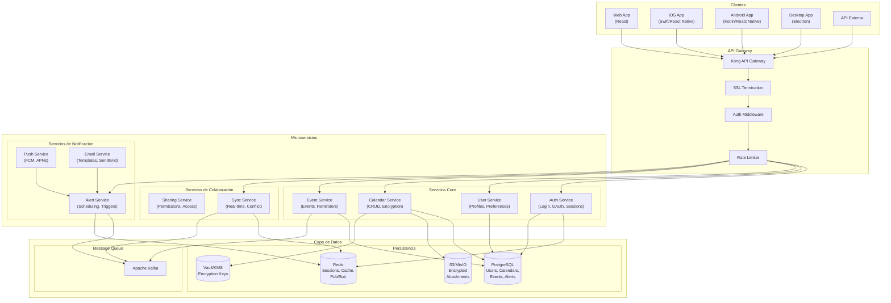
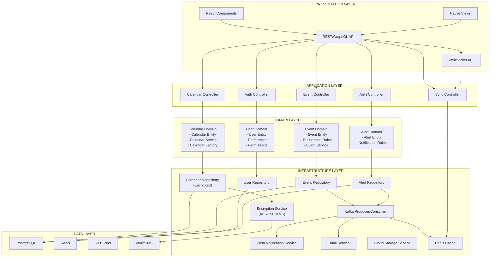
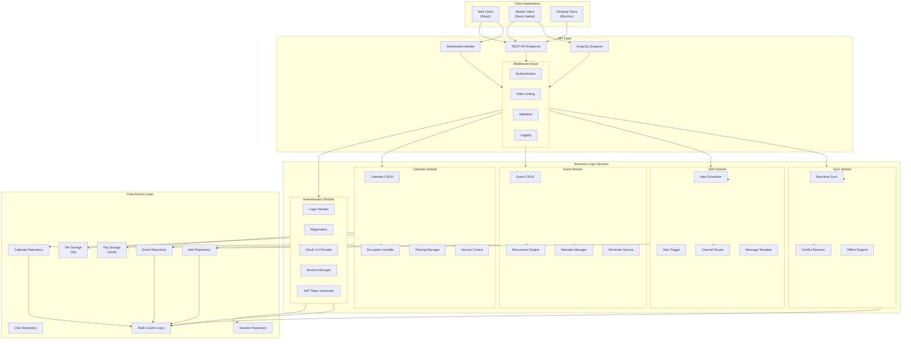
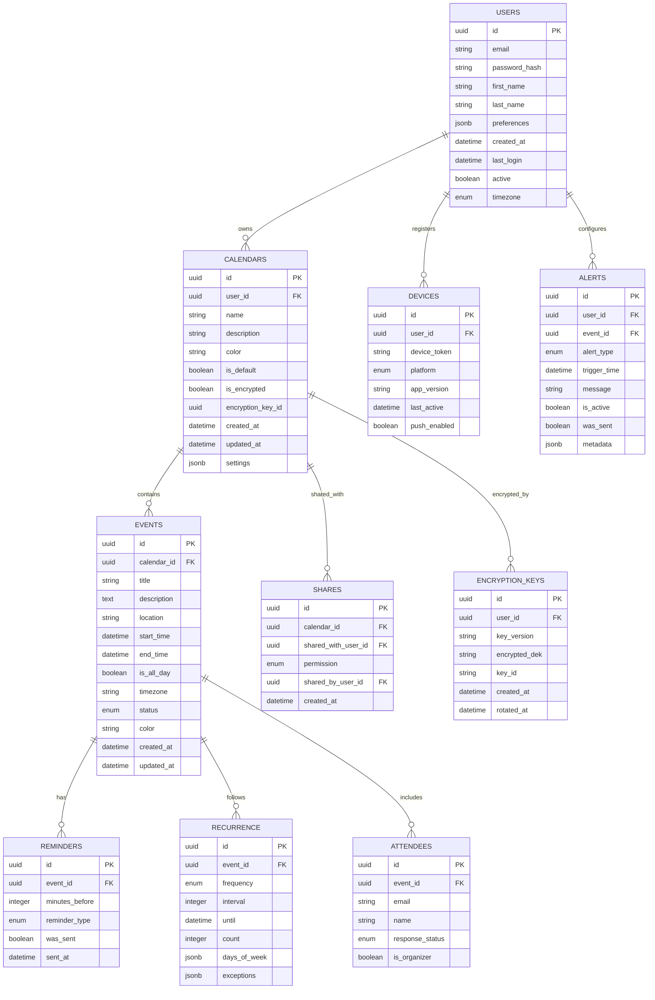
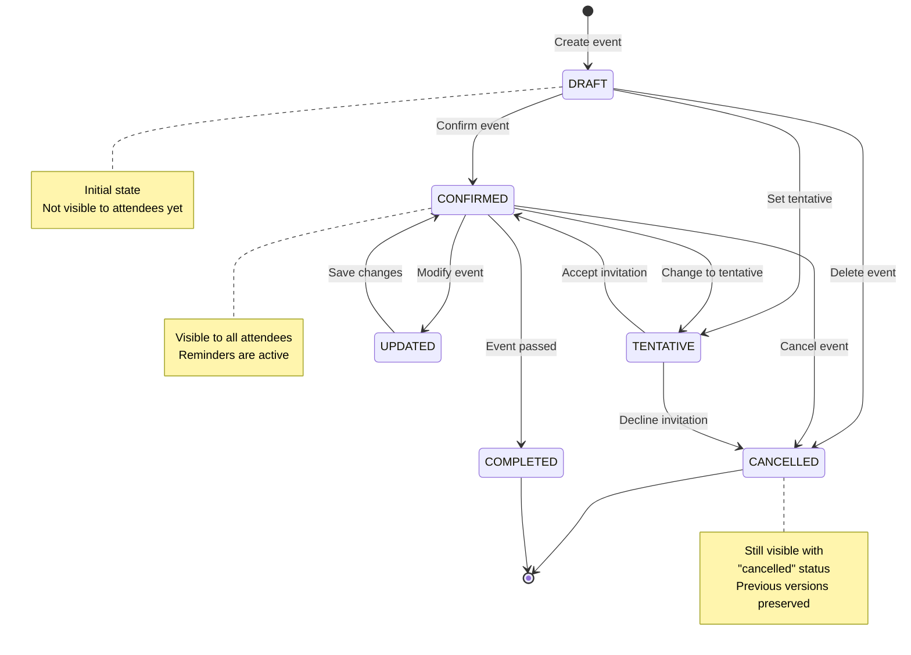
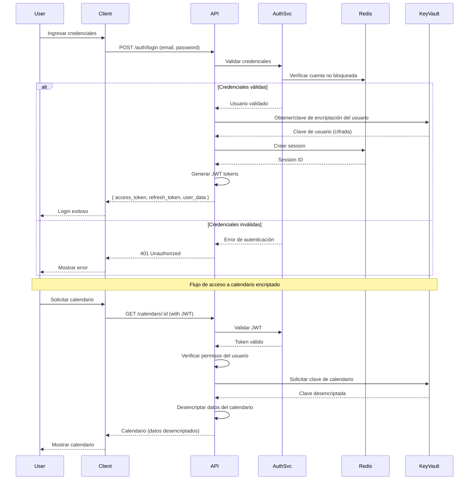

# Diagramas de Arquitectura - Sistema de Calendario Multiplataforma

## 1. Diagrama de Arquitectura General del Sistema



---

## 2. Diagrama de Arquitectura de Capas



---

## 3. Diagrama de Componentes Detallado



---

## 4. Diagrama de Base de Datos (ER)



---

## 5. Diagrama de Estados (Event State Machine)



---

## 6. Diagrama de Flujo de Autenticación



---

## 7. Diagrama de Flujo de Notificaciones

```mermaid
sequenceDiagram
    participant Event
    participant AlertSvc
    participant Kafka
    participant Worker
    participant PushSvc
    participant EmailSvc
    participant User
    
    Event->>AlertSvc: Evento creado/actualizado
    AlertSvc->>AlertSvc: Crear alertas según preferencias
    
    loop Para cada alerta configurada
        AlertSvc->>AlertSvc: Calcular trigger_time
        AlertSvc->>Kafka: Publicar alerta programada
    end
    
    Kafka->>Worker: Consumir mensaje de alerta
    
    Worker->>Worker: Verificar trigger_time alcanzado
    
    alt Tiempo de trigger alcanzado
        Worker->>Worker: Obtener detalles del evento
        Worker->>Worker: Seleccionar canal preferido
        Worker->>Worker: Generar mensaje
        
        alt Canal