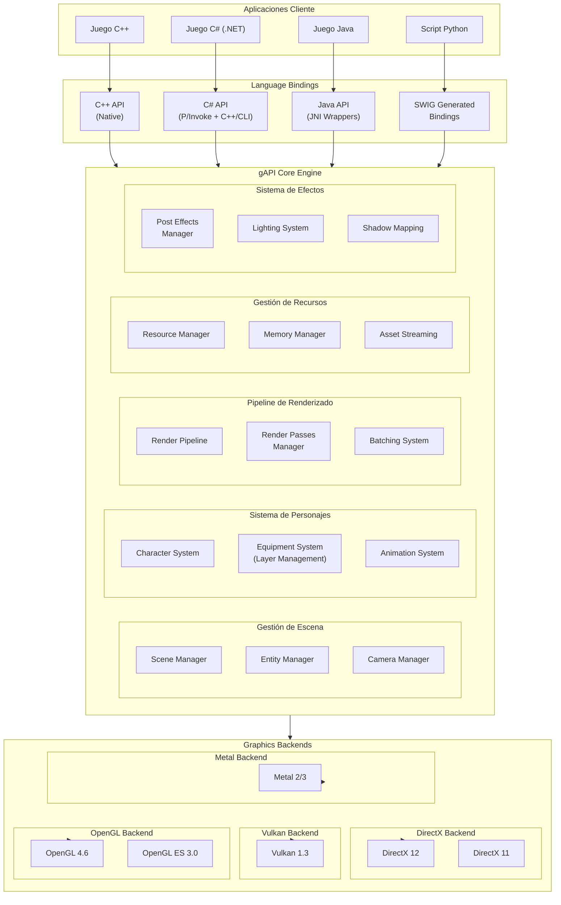
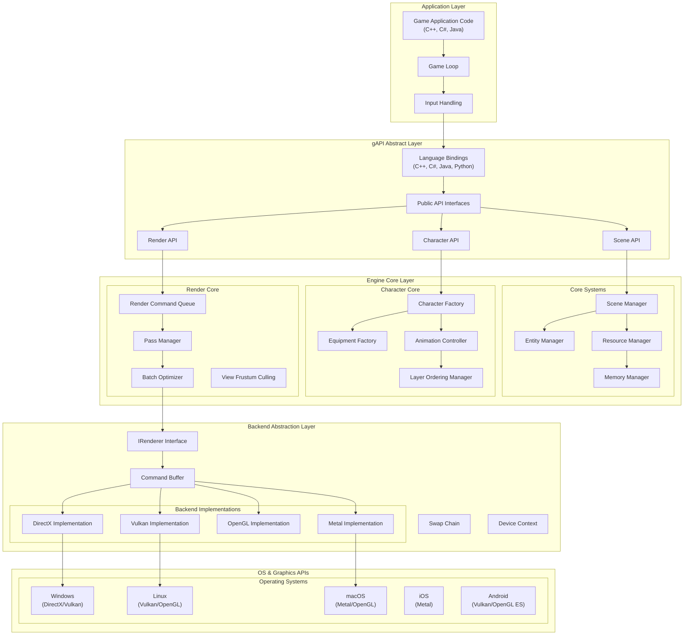
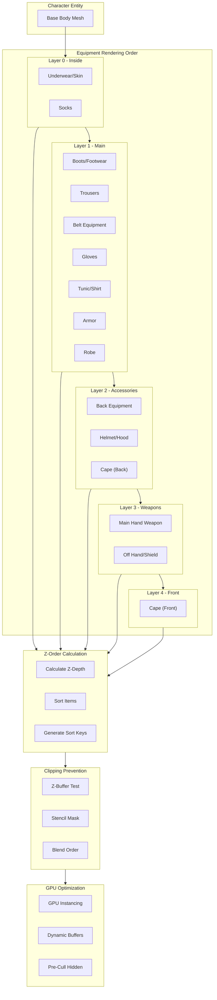
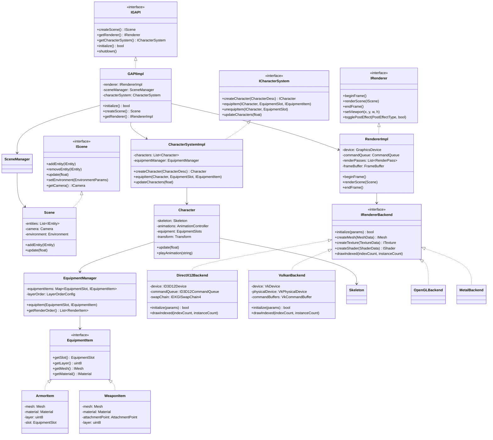
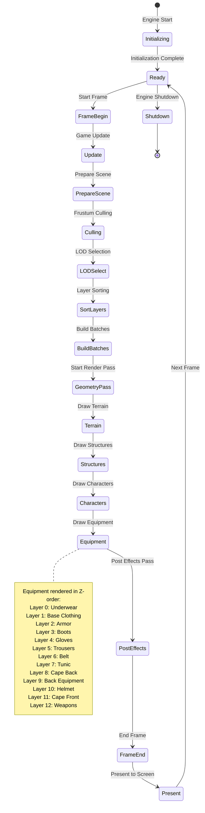
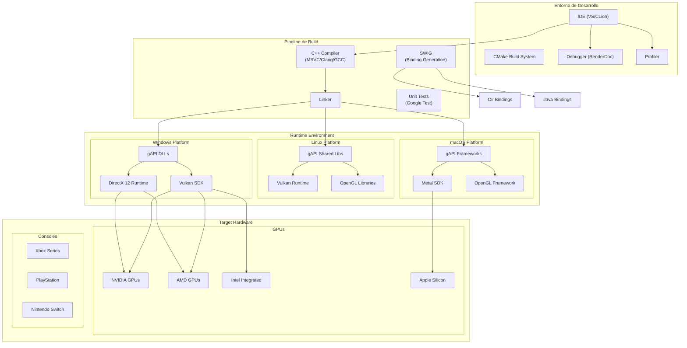
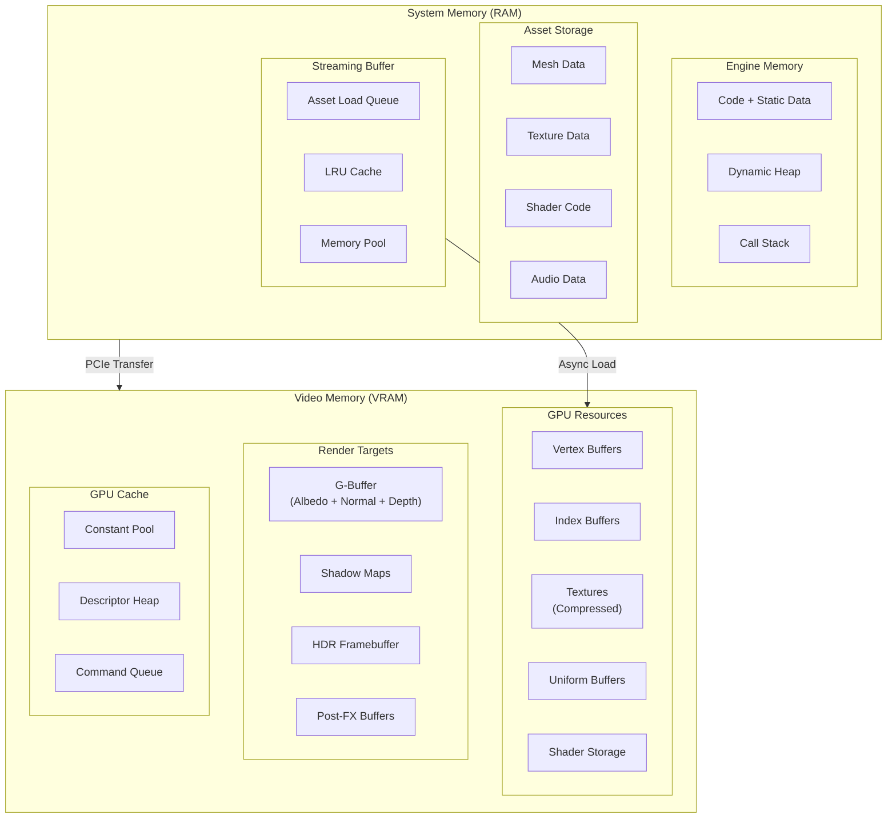
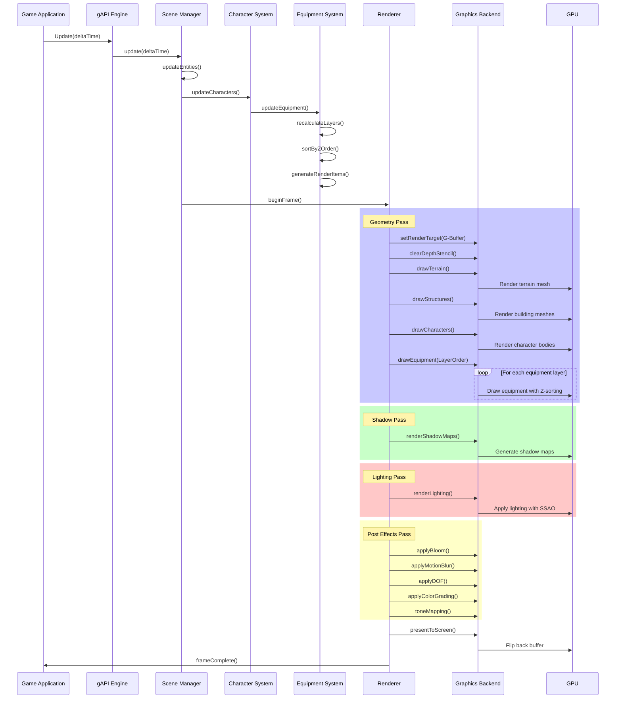

# Diagramas de Arquitectura - Sistema gAPI (Motor Gráfico)

## 1. Diagrama de Arquitectura General del Sistema

---

## 2. Diagrama de Arquitectura de Capas

---

## 3. Diagrama de Componentes del Motor

---

## 4. Diagrama de Pipeline de Renderizado

```mermaid
flowchart TB
    subgraph Application["Game Application"]
        GameLoop["Game Loop"]
        Update["Update State"]
    end

    subgraph Preparation["Scene Preparation"]
        UpdateTrans["Update Transforms"]
        UpdateAnim["Update Animations"]
        UpdateEquip["Update Equipment"]
        FrustumCull["Frustum Culling"]
        LODSelect["LOD Selection"]
        SortLayers["Sort by Layer\n(Equipment)"]
        BuildBatches["Build Render Batches"]
    end

    subgraph GeometryPass["Geometry Pass"]
        subgraph TerrainLayer["Layer 0: Terrain"]
            TerrainMesh["Terrain Mesh"]
            TerrainMat["Terrain Material"]
        end
        
        subgraph StructureLayer["Layer 1: Structures"]
            Buildings["Buildings"]
            Props["Props"]
            Occluders["Occluders"]
        end
        
        subgraph CharacterLayer["Layer 2: Characters"]
            CharacterBody["Character Body"]
            Skeleton["Skeleton"]
        end
        
        subgraph EquipmentLayer["Layer 3: Equipment"]
            LayerOrder3["Render by Z-Order"]
            InstancedDraw["GPU Instancing"]
        end
    end

    subgraph ShadowPass["Shadow Pass"]
        ShadowMaps["Shadow Maps\n(Directional + Point)"]
        PCF["PCF Filtering"]
        VSM["Variance Shadow Maps"]
    end

    subgraph LightingPass["Lighting Pass"]
        GBuffer["G-Buffer\n(Albedo, Normal, Depth)"]
        LightPrep["Light Prepass"]
        DeferredLighting["Deferred Lighting\n(Forward/Deferred)"]
        SSAO["SSAO"]
    end

    subgraph PostEffectsPass["Post Effects Pass"]
        Bloom["Bloom"]
        MotionBlur["Motion Blur"]
        DOF["Depth of Field"]
        ColorGrade["Color Grading"]
        ToneMap["Tone Mapping"]
    end

    subgraph Output["Output"]
        FrameBuffer["Frame Buffer"]
        Present["Present to Screen"]
        HDR["HDR to SDR"]
    end

    %% Flujo
    GameLoop --> Update
    Update --> UpdateTrans
    UpdateTrans --> UpdateAnim
    UpdateAnim --> UpdateEquip
    UpdateEquip --> FrustumCull
    FrustumCull --> LODSelect
    LODSelect --> SortLayers
    SortLayers --> BuildBatches
    
    BuildBatches --> GeometryPass
    GeometryPass --> ShadowPass
    ShadowPass --> LightingPass
    LightingPass --> PostEffectsPass
    PostEffectsPass --> Output
```

---

## 5. Diagrama de Sistema de Equipamiento (Capas)

---

## 6. Diagrama de Clases Principal

---

## 7. Diagrama de Estados de Renderizado

---

## 8. Diagrama de Despliegue

---

## 9. Diagrama de Arquitectura de Memoria

---

## 10. Diagrama de sequence - Renderizado de Frame

---

## 11. Diagrama de Arquitectura de Shaders

```mermaid
flowchart TB
    subgraph ShaderTypes["Shader Types"]
        VS["Vertex Shader"]
        HS["Hull Shader (Tessellation)"]
        DS["Domain Shader (Tessellation)"]
        GS["Geometry Shader"]
        PS["Pixel Shader"]
        CS["Compute Shader"]
    end

    subgraph RenderingTechniques["Rendering Techniques"]
        subgraph TerrainShaders["Terrain Shaders"]
            TerrainVS["Terrain Vertex Shader"]
            TerrainPS["Terrain Pixel Shader\n(Texture Splatting)"]
        end
        
        subgraph CharacterShaders["Character Shaders"]
            CharVS["Character Vertex Shader\n(Skinning)"]
            CharPS["Character Pixel Shader\n(PBR Lighting)"]
        end
        
        subgraph EquipmentShaders["Equipment Shaders"]
            EquipVS["Equipment Vertex Shader"]
            EquipPS["Equipment Pixel Shader\n(PBR + Layer Sorting)"]
        end
        
        subgraph EffectShaders["Effect Shaders"]
            ShadowVS["Shadow Vertex Shader"]
            ShadowPS["Shadow Pixel Shader"]
            BloomPS["Bloom Pixel Shader"]
            SSAOPS["SSAO Pixel Shader"]
            DOFPS["DOF Pixel Shader"]
        end
    end

    subgraph ShaderSystems["Shader Systems"]
        PBR["PBR Lighting System\n(Metallic-Roughness)"]
        Skinning["Skinning System\n(Vertex Blending)"]
        Instancing["Instancing System\n(GPU Batching)"]
    end

    %% Conexiones
    VS --> TerrainVS
    VS --> CharVS
    VS --> EquipVS
    VS --> ShadowVS
    
    PS --> TerrainPS
    PS --> CharPS
    PS --> EquipPS
    PS --> BloomPS
    PS --> SSAOPS
    PS --> DOFPS
    
    PBR --> CharPS
    PBR --> EquipPS
    PBR --> TerrainPS
    
    Skinning --> CharVS
    Skinning --> EquipVS
    
    Instancing --> EquipVS
    Instancing --> TerrainVS
```

